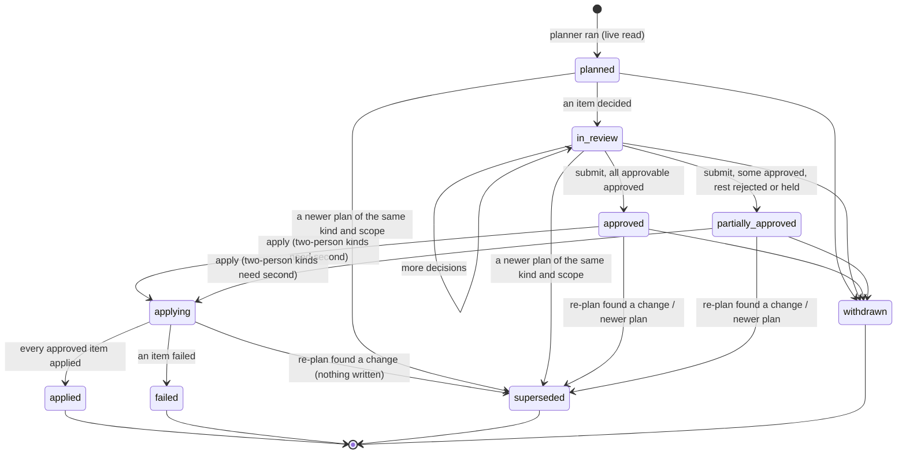

# The approval workflow

This is the core of the console. jason plans a write. A named person reviews it item by item and approves some or all of it. jason reads the live state again, refuses if anything the approval relied on has changed, applies only what was approved, and records every step.

The model lives in `jason.approvals` (new, `src/jason/approvals/`), not in the console. The console, the CLI (`jason approvals`), and `jason-mcp` are three doors onto one store ([CLI and MCP parity](#cli-and-mcp-parity)).

This page is the engine's contract:
- **Names are binding.** The record and field names, the states, and the transitions below are the names the engine uses: `Approval`, `PlanItem`, `Decision`, `ApprovalStatus`, `ActionKind`.
- **The JSON Schemas in `src/jason/approvals/schemas/` mirror the dataclasses.** If the two ever differ, this page and the schema are corrected together.
- **Where each piece goes.** Per-screen layouts are in [screens/](screens/), and the components are in [components.md](components.md).

## 1. The first case: the owner-information cycle

The rest of this page generalizes `jason owner-info --apply --payhoa`, as written today.

**`commands.owner_info._apply`** does the following:
1. It reads PayHOA live: every unit page (`client.list_units`) and every person (`client.iter_people`).
2. It gathers every answer (`_answers`): the saved outside-form responses, and with `--payhoa` the PayHOA form's signed-in submissions (`payhoa_forms.fetch_submissions`), less the test memberships (`config.test_memberships`).
3. It builds the ledger (`_rows` → `owner_info.ledger`).
4. It plans the writes: `owner_info.plan_writes(rows, found, tags, earlier=..., today=...)` returns `Write(kind, target, label, value, why)`. The kinds are `member tag +`, `member tag -`, `unit tag +`, and `unit tag -`. The reasons:
   - the default delivery tag where an owner has no election (Civil Code 4040(a)(2));
   - an earlier written election's tags (`EarlierElections`);
   - a this-cycle answer's tag changes.
5. It drops any `member…` write whose target is a test membership.
6. With `--payhoa`, it **holds for the board** the unit occupancy-tag writes for units whose response the policy flags. Those are `owner_responses.triage(context)` findings with `Outcome.BOARD` and rule `occupancy-vs-tag`. It prints them as "held for the board", and they are never written.
7. It prints the plan. Without `--yes` it stops there. With `--yes` it calls `owner_info.execute(client, org, writes, member_tag_rows=...)`, which batches member additions by tag (25 at a time), removes a tag by its tag-row id, and adds or removes unit tags. It returns counts by kind.
8. With `--payhoa`, it runs `_complete_requests`. For each owner's open PayHOA request (`owner_info.to_complete`), `item.left` lists what is still to do:
   - a write not yet made;
   - something a person enters (`FOR_A_PERSON`: an email, a mailing address, a secondary delivery, a property manager, and the representative fields in `PERSON_FIELDS`);
   - every non-`RECORD` finding of the response policy.

   A request with nothing left is completed with `owner_info.complete`. That marks the submission complete and leaves `OWNER_INFO_COMPLETED_COMMENT`, which is **emailed to the owner** (`recipient_member_ids`). This exception is the board's rule, recorded in AGENTS.md.

**`owner_responses.Outcome`** sorts every finding into one of five classes. The console's item classes map one to one:

| Outcome | Meaning | In an approval |
|---|---|---|
| `RECORD` | jason writes it | An **approvable** item: a tag write |
| `PERSON` | A person enters or removes something in PayHOA | A **for a person** item, never approvable. It holds its request open |
| `CONFIRM` | Ask the owner before relying on it | A **confirm with the owner** item, never approvable here. It holds the request open. Asking the owner is a message, a separate kind |
| `BOARD` | A question of policy | A **held for the board** item, with its `Finding.board_item`. Never approvable |
| `IGNORE` | A test account's answer | Hidden by default, and counted |

Three facts in today's code shape the requirements. They are listed again in [mvp.md](mvp.md#prerequisites-in-jason).
- `execute` returns counts, not a result for each item. A failure part-way through raises, and loses which writes were made. **The audit needs a result for each item.**
- After `execute`, `_apply` sets `writes = []`, so `_complete_requests` treats every write as made. **With approval by item, the pending list must be the writes not applied**, whether rejected, skipped, or failed. Then a request whose write was not approved stays open.
- `owner_responses.contexts` calls `_live` again, and `_apply` calls `contexts` twice (once for the held writes, once in `_complete_requests`). One plan reads PayHOA three times. **A plan should read live once**, and give the planner, the triage, and the fingerprint the same snapshot.

## 2. Survey: every write jason gates today

There are four ways a write is confirmed today:
- **`--yes`**, a bare confirmation;
- **`--yes --confirmed-by NAME`** on batches, and `jobs add --confirm NAME`;
- **`--by NAME`**, which signs a `data/` record;
- **a second person** (`intake.confirm`, `onboarding_confirm`).

The tables classify every path found by grepping `--yes`, `--confirmed-by`, `--confirm`, and `--by` in `src/jason/cli.py` and `src/jason/commands/`.

**Risk tiers**

| Tier | Meaning |
|---|---|
| **R0** | Local only. It writes under `data/` or the checkout, and can be undone from a backup or by editing |
| **R1** | Private, outside jason. It creates or changes something only the association's own people see, such as a Gmail draft, a private Doc, a calendar event jason made, or a Drive label. A person can undo it |
| **R2** | Member-facing record. It changes what the association's records say about members, or what members will receive or see, such as PayHOA tags, a live form, or a request marked complete. Partly reversible: a tag can be removed, but an email that went out cannot be recalled |
| **R3** | Irreversible, costly, or legal. It sends to members, mails, publishes, or starts a legal process |

**Whose decision**

| Rule | Meaning |
|---|---|
| **M** | The manager's: a routine write the documents and law already call for |
| **BR** | A board decision already made: a rule row authorizes it, and the item recites the row |
| **2P** | A second person must confirm |
| **B** | Only the board. Never approvable |

### PayHOA

| Path | Writes | Tier | Reversible | Cost | Decision | Legal clock |
|---|---|---|---|---|---|---|
| `owner-info --apply --payhoa --yes` | Member and unit tags (`owner_info.execute`) | R2 | Yes: remove or add the tag | None | M; the default mail tag recites 4040(a)(2) | The cycle's deadlines (`AnswerCycle.deadlines`): answers in PayHOA before the annual reports |
| the same, request completion | Submission complete, plus a comment **emailed to the owner** (`owner_info.complete`) | R2 | Status yes; the email no | None | BR: the board's owner-information rule | None of its own |
| `delivery --audit --apply --yes` | Delivery tags so PayHOA's filters find every owner | R2 | Yes | None | M | How notices go under 4040 and 4041 |
| `forms --payhoa KEY --yes` | A new PayHOA form, switched off (`payhoa_forms.create`) | R1 | Yes, while unlinked | None | M | — |
| `forms --payhoa KEY --yes --enable` | The same, switched on for owners | R2 | Turning it off, yes. Answers received stay | None | M | — |
| `forms --payhoa KEY --update --yes` | A live, locked form edited in place, keeping question ids (`payhoa_forms.update`) | R2 | By another update | None | M; 2P if it changes a question owners have answered | The cycle, when it is the owner-information form |
| `forms --payhoa KEY --replace --yes` | Deletes an unlocked form with no submissions and makes it again | R2 | No | None | M. **Refused** for a locked form (`payhoa_forms.lock`) | — |
| `forms --payhoa-test KEY --yes` | Submits answers as the test owner | R1 | Test data | None | M | — |
| `request-links --create THREAD --yes` | Enters an emailed request in PayHOA (never approved, denied, or assigned) | R2 | No: the owner can see it | None | M | It starts the request's clock in PayHOA |
| `broadcast --upload PDF --yes` | A PDF in the library's private Email Attachments folder | R1 | Yes | None | M | — |
| `broadcast --send-sample --yes` | A test copy to the admin's own membership | R1 | No, but only to the admin | None | M | — |
| `broadcast --save-template ID --yes` | Replaces a saved template's subject and body, and drops its attachments | R2 | Only by saving again | None | M | — |
| `broadcast --notice KEY --by NAME --yes` | Keeps the notice's rendered text in `data/notices/KEY/` (`notice_text`) | R0 | Yes | None | Signed | The notice's own clock |
| `mailroom --pdf F --units U --send --yes` | **Prints and mails letters, charged to the association** (`mailroom.send`) | R3 | No: only cancellable while processing | Per billed page plus postage (`payhoa.pricing.PRICING`, `mailroom.page_count`). A sixth billed page adds postage | 2P | The notice's clock, when the letter is a notice |
| `mailroom --cancel ID --yes` | Cancels a letter still processing | R2 | No | Saves the charge | M | The notice's clock: cancelling may miss it |
| `owner-info --email-batch --yes --confirmed-by NAME` | Emails each owner their own copy, as a resumable batch (`jason.batches`) | R3 | No | None | 2P | The cycle, and the notice's clock |
| `owner-info --mail-batch --yes --confirmed-by NAME` | A Mailroom letter to each owner without an email election, as a batch | R3 | No | Per letter, as above | 2P | The same |
| `batches --cancel ID --yes` | Skips a batch's pending items | R0 (ledger), which stops R3 sends | Pending items can be put back | Saves the rest | M | It may leave a notice undelivered |

### Google

| Path | Writes | Tier | Reversible | Decision | Legal clock |
|---|---|---|---|---|---|
| `draft --… --yes`, `draft --edit ID --yes` | A Gmail draft, never sent | R1 | Yes | M | That of the notice it drafts |
| `respond --draft ID --gmail --yes` | An acknowledgment as a Gmail draft in the request's thread | R1 | Yes | M | The request's clock |
| `rule-change KEY --draft-email --yes --by NAME` | The member notice as a Gmail draft, kept in the notice ledger | R1 | Yes | Signed, M | Civil Code 4360(a): 28 days before the decision |
| `hold --notices --yes` | Preservation-notice Gmail drafts | R1 | Yes | M, after counsel | The duty to preserve (counsel) |
| `hold --vault --yes` | A Google Vault matter, with its Drive and Mail holds | R3 | A hold can be released, but releasing early may destroy evidence | 2P, after counsel | The duty to preserve |
| `hold --label --yes` | `jason_hold` on held Drive files | R1 | Yes | M | — |
| `forms --create KIND --yes` | A Google Form, unpublished | R1 | Yes | M | — |
| `forms --publish ID --yes` | **Anyone with the link can answer** | R3 | Unpublishing, yes. Answers received stay | 2P | — |
| `calendar --yes` | Creates or patches jason's own events. Never deletes, and never changes another's event | R1 | Yes | M | Shows clocks; sets none |
| `schedule --calendar --yes`, `schedule --tasks --yes` | All-day events, and Tasks on each role's list | R1 | Yes | M | Shows clocks |
| `templates --build/--rewrite/--generate --yes` | Template Docs (`--rewrite` replaces a body) | R1 | Through Drive revisions | M | — |
| `letter --yes` | A filled copy of a template | R1 | Yes | M | — |
| `board --agenda --doc --yes`, `board --packet --doc --yes` | The agenda or packet as a private Doc | R1 | Yes | M | 4920: the notice date the agenda carries |
| `report KEY --doc --yes` | The report's own Doc, plus a packet run's PDF | R1 | Through Drive revisions | M | — |
| `packet --make-templates --yes`, `packet --build --yes` | Template Docs, filled copies, and the merged PDF | R1 | Yes | M | The annual disclosures' window (5300) |
| `hearing --doc --yes` | The notice of hearing as a Doc | R1 | Yes | M | 5855: notice before the hearing |
| `registers --create KEY --yes` | A register Sheet | R1 | Yes | M | — |
| `drive-labels --apply --yes` | jason's appProperties on Drive files | R1 | Yes | M | — |
| `photos --publish/--to-drive SLUG --yes` | An album jason created; copies in Drive | R1 | Yes | M | — |

### Zoom, local, and the machine

| Path | Writes | Tier | Decision | Legal clock |
|---|---|---|---|---|
| `hearing --create --yes` | A Zoom meeting on the association's account | R3. The hearing date starts the notice clock | 2P | 5855 |
| `spec --migrate --yes` | Copies private-fact topics into the profile's folder, after a backup; no source changes | R0 | M | — |
| `living --use-reread R --yes --by NAME` | Switches a scanned base to a re-read | R0. It changes the words jason recites | Signed. **Treat as 2P**: it is an `intake.HIGH_STAKES` kind of decision (which words are in force) | — |
| `section-refs --apply PATH --yes` | Writes a proposal's tokens into a file | R0 | M | — |
| `intake --answer/--confirm/--apply`, `onboard --answer/--confirm/--apply` | Answers, a second person, records, private facts with a backup and a diff, and profile proposals as patches under `data/onboarding/proposals/` | R0. A private-fact merge is P3 data | Signed. 2P for `high_stakes` answers. A proposal is applied by a person with `git apply` | The clock the answer sets, when it sets one (`FactAsk.clock`) |
| `ingest SOURCE --apply` | Copies files into `data/library` and `library.db` | R0 | M | — |
| `jobs add --confirm NAME -- CMD --yes` | Queues a write for the worker | As the command | As the command. The job keeps the name | As the command |
| `anythingllm --start/--stop/--apply/--reembed --yes`, `local-ai --restart-ollama/--unload --yes` | The machine's own services, not the association's records | Ops | M | — |

### Writes with no gate today

These are findings for later, not part of this spec. Each should get a registry row and a dry run before the console offers it:
- `board --sheet`, `board --create-sheet`, and `board --tasks` write the board's Google Sheet and Tasks without `--yes`.
- `property-history --sheet` creates a spreadsheet without `--yes`.
- `board --set` and `schedule --done --by` write local records. Signed, they are fine as R0.

## 3. The `Approval` record

```python
class ApprovalStatus(Enum):
    PLANNED = "planned"                    # jason made the plan; nobody has decided an item
    IN_REVIEW = "in review"                # at least one item decided, not yet submitted
    APPROVED = "approved"                  # submitted: every approvable item approved
    PARTIALLY_APPROVED = "partially approved"   # submitted: some approved, the rest rejected or held
    APPLYING = "applying"                  # re-plan passed; writes under way
    APPLIED = "applied"                    # every approved item applied
    FAILED = "failed"                      # one or more approved items failed; waits for a person
    SUPERSEDED = "superseded"              # a re-plan found the live state changed, or a newer plan replaced it
    WITHDRAWN = "withdrawn"                # a person withdrew it before apply


class ItemClass(Enum):
    APPROVABLE = "approvable"
    HELD_FOR_BOARD = "held for the board"       # Outcome.BOARD: never approvable
    FOR_A_PERSON = "for a person"               # Outcome.PERSON: done by a person in the system itself
    CONFIRM_WITH_OWNER = "confirm with the owner"   # Outcome.CONFIRM: a message is its own kind
    INFORMATIONAL = "informational"             # what would follow (a request that stays open, and why)


class Decision(Enum):
    UNDECIDED = "undecided"
    APPROVED = "approved"
    REJECTED = "rejected"                  # not written; needs a reason
    HELD = "held for the board"            # a person refers an approvable item to the board; not written; needs a reason


class Result(Enum):
    PENDING = "pending"
    APPLIED = "applied"
    NOT_APPLIED = "not applied"            # rejected, held, or not approvable
    CHANGED = "changed since review"       # refused at apply: its basis moved
    BLOCKED = "blocked"                    # a prerequisite item did not apply
    FAILED = "failed"
    UNCERTAIN = "uncertain"                # the request went out and no answer came back: verify before anything else


@dataclass(frozen=True)
class Evidence:
    label: str                             # "PayHOA submission 1234", "Civil Code 4040(a)(2)"
    address: str                           # a jason:// address, a console path, or a local file under data/
    level: str = "P1"                      # the data level it opens (security-and-privacy.md)


@dataclass
class PlanItem:
    id: str                                # stable: sha256(kind|op|target|value)[:16]
    op: str                                # the kind's verb: "member tag +", "complete request"
    target: str                            # "member:123", "unit:45", "submission:678"
    label: str                             # who or what, for the reader: "Unit A: an owner" (P1)
    value: str                             # the tag, the field's text
    why: str                               # the planner's reason, as today's Write.why
    rule: str = ""                         # a citation expression jason cite resolves: "CIV 4040(a)(2)"
    evidence: tuple[Evidence, ...] = ()
    basis: str = ""                        # sha256 of the target's live state this item relies on
    klass: ItemClass = ItemClass.APPROVABLE
    board_item: str = ""                   # for HELD_FOR_BOARD: the board item it waits on
    depends_on: tuple[str, ...] = ()       # item ids that must apply first (a completion on its writes)
    decision: Decision = Decision.UNDECIDED
    decided_by: str = ""
    decided_at: str = ""
    reason: str = ""                       # required to reject
    result: Result = Result.PENDING
    result_detail: str = ""


@dataclass(frozen=True)
class Signature:
    name: str                              # the named person (security-and-privacy.md: identity)
    role: str                              # Role.value
    at: str                                # UTC, ISO 8601, seconds
    fingerprint: str                       # the plan fingerprint the person signed
    via: str                               # "console", "cli"


@dataclass
class Approval:
    id: str                                # "apr-" + UTC stamp + 4 random hex: apr-20990101T120000-1a2b
    kind: str                              # an ActionKind key: "payhoa.owner-info.tags"
    scope: dict                            # the planner's arguments: {"payhoa": true, "cycle": 2099}
    profile: str                           # the active profile's name when planned
    items: list[PlanItem]
    fingerprint: str                       # sha256 over (kind, scope, approvable items' id and basis)
    read_at: str                           # when the live state was read
    requested_by: str                      # the person who asked for the plan
    requested_at: str
    requested_via: str                     # "console", "cli"
    status: ApprovalStatus = ApprovalStatus.PLANNED
    first: Signature | None = None         # who submitted the decisions
    second: Signature | None = None        # the second person, for a two-person kind
    cost: dict | None = None               # the kind's cost estimate, integer cents
    clock: dict | None = None              # the legal clock: {"what", "due", "authority"}
    supersedes: str = ""
    superseded_by: str = ""
    notes: list[str] = field(default_factory=list)   # e.g. "4 writes new since review, not included"
```

**The plan as JSON.** The record is stored whole, items included, as JSON in `data/console/approvals.db`: SQLite, like `jobs.db` and `batches.db`. One row per approval, plus an `items` table for queries. Enums are stored as their values and turned back into members on load, the way AGENTS.md asks.

**Held items and items for a person** are items with their class set. They are stored, shown in their own sections, and counted. They are never decided. Keeping them in the record means the approval is the full picture a person reviewed, not just the writes.

**Evidence links.** The planner attaches its evidence:
- the PayHOA submission, as a console path to the owner's response;
- the rule, as a `jason://` address or a statute citation;
- the board item;
- the ledger row.

An evidence chip opens the evidence at its data level. A P2 chip asks before revealing.

### Fingerprints

- **The item id** is `sha256(f"{kind}|{op}|{target}|{value}")[:16]`. It is the same on every re-plan for the same write.
- **The basis** is a sha256 over a canonical serialization of what the item relies on, read live:

  | Item | Its basis |
  |---|---|
  | A member tag | the member's sorted tag names, and for a removal the tag row's id |
  | A unit tag | the unit's sorted tag names |
  | A request completion | the submission's status, a hash of its answers, and the triage findings' rule keys |
  | A Mailroom send | the PDF's sha256, the resolved recipients' ids, and PayHOA's addresses for them |

- **The plan fingerprint** is `sha256(json.dumps({"kind", "scope", "items": sorted([id, basis] for approvable items)}, sort_keys=True, separators=(",", ":")))`. It is shown as its first 12 hex digits. The canonical form (sorted keys, no spaces) makes it reproducible on any machine.
- A signature records the fingerprint it signed. A second person signs **the same** fingerprint, or nothing.

## 4. The state machine



| From | Event | To | Guard |
|---|---|---|---|
| — | plan | planned | The kind's planner ran on a live read. If an open approval of the same kind and scope exists, it becomes superseded |
| planned, in review | decide an item | in review | The item is approvable. A rejection or a hold needs a reason |
| in review | submit (name) | approved (every approvable item approved), or partially approved (some approved, the rest rejected or held) | Every approvable item is decided: approved, rejected, or held. At least one is approved; if none is, the approval becomes **withdrawn**, with "nothing approved", and its holds still propose their board items |
| approved, partially approved | second-person confirm (name) | unchanged; `second` set | The kind is 2P. The name differs from `first.name` and from `requested_by` (casefold, trimmed) |
| approved, partially approved | second-person decline (name, reason) | in review | The decisions are kept and `first` is cleared. The first person must submit again |
| approved, partially approved | apply (name) | applying | 2P kinds have `second`. The plan is no older than the kind's `max_age` |
| applying | re-plan differs | superseded | Nothing is written. A new approval is made from the re-plan, with `supersedes` set |
| applying | done | applied, or failed | — |
| any but applying and terminal | withdraw (name, reason) | withdrawn | — |

**Approved and partially approved** are separate states because a reader of the log must see at a glance that a person chose to leave writes out.

**Terminal states are final.** A failed approval is never retried automatically, which is the rule `jason.jobs` keeps for writes. A person reads why, plans again, and approves the new plan.

## 5. Approval by item

- **Items are approved one by one.** "Approve all approvable" is a shortcut that sets each one; the log records each item's decision.
- **The default is undecided**, never approved. Nothing is pre-checked.
- **A rejection needs a reason** of a few words: "owner called; wants email". The reason goes in the log.
- **A person can hold an approvable item for the board** (`Decision.HELD`). This is for a write the rules allow but the person thinks the board should see first.
  - It needs a reason, as a rejection does.
  - The item is not written.
  - Submitting proposes a board item with the reason and the item's evidence, through `tasks.board_items.propose`, signed by the person. It goes to `data/board/items.json`, which the board owns from then on.
  - The approval links the board item.
  - Unlike the planner's `HELD_FOR_BOARD` class, a person's hold is a decision, and is logged as one.
- **Groups.** Items are grouped by target, such as a member, or a unit and its members. One person's changes read together.
  - A group can be approved or rejected at once.
  - A dependent item (a request completion) sits in its target's group, and shows which writes it waits on.
- **What follows a rejection.** A rejected write leaves its request open. The completion item shows that it will be blocked (`Result.BLOCKED`), because `to_complete` lists the unwritten write in `left`.
- **Items for a person** come with the task they need: "enter the mailing address in PayHOA" for that owner. They link to the owner in PayHOA's own interface (the `jason party` link). There is no checkbox, because jason does not do them.

## 6. Re-plan before apply

Apply always re-reads. It never trusts the stored plan's live state.

1. Under the store lock (`hold(Resource.STORE, "approvals")`), move the approval to `applying`. Refuse if:
   - it is not approved or partially approved;
   - a 2P kind has no second signature;
   - `read_at` is older than the kind's `max_age`.
2. Take the kind's resource lock for the whole apply (`hold(Resource.PAYHOA, "approval-<id>")` for PayHOA kinds). This is the pattern `jason.batches` uses.
3. Run the kind's planner again with the same `scope`, on one live read.
4. Compare each **approved** item with the re-plan:
   - **Same id, same basis, still approvable:** it goes ahead.
   - **Missing, a different basis, or now held** (a new board finding, for instance): the item is `CHANGED`.
5. If any approved item is `CHANGED`, **refuse the whole apply**. Nothing is written. Then:
   - the approval becomes `superseded`;
   - the log records the changed items, with the old and new basis;
   - a new approval is made from the re-plan, with `supersedes` set.

   The new approval shows the earlier decisions as hints ("approved earlier by A Person"). It does not count them. This is GitHub's dismissal of stale approvals, applied item by item, and Terraform's stale-plan refusal applied to the approved set.
6. Items that are **new** in the re-plan do not block an apply, because they were never approved. The log notes them ("3 writes new since review, not included"), and they wait for the next plan.
7. Write each approved item through the kind's applier:
   - log the intent first (`item.applying`), then the result, as `batches` marks an item sending before its request;
   - an item cut off mid-request is `UNCERTAIN`, and the next plan's live read settles it;
   - a dependent item applies only when every item it depends on is `APPLIED`, and the kind's own re-check passes. For a completion, `to_complete` is run with the writes not applied as pending, and `left` must be empty.
8. Finish:
   - every approved item `APPLIED`: the approval is `applied`;
   - otherwise: `failed`, with each failed item's error.

Why refuse the whole apply, rather than apply the unchanged part? A partial picture is what a person did not review. When an owner submits a new answer between review and apply, every write for that owner may need to change, and the reviewer should see that. A re-plan takes seconds. A person's attention is what is scarce.

## 7. The second-person rule

A **two-person (2P) kind** needs two signatures on the same fingerprint.

**Who signs**
- The **first** person submits the decisions.
- The **second** person reviews the same plan and confirms. They cannot change a decision: a change is a decline, which sends the approval back to review.

**What is refused**
- The second name may not equal the first signer's name or the requester's. Names are compared casefold and trimmed, as `intake.confirm` does.
- The console shows the refusal; it does not merely warn.

**What lapses**
- Any re-plan that changes the fingerprint clears both signatures, because the new plan is a new approval.

**Which kinds are 2P** (the registry's `approver` column):
- sends to members, by email or mail;
- money: Mailroom postage;
- publishing to anyone with a link;
- legal process: Vault holds, a hearing scheduled;
- a change to which words are in force: `living --use-reread`, and the high-stakes intake kinds.

**The limits, stated plainly**
- Until sign-in exists, a name is self-asserted at a shared machine. The rule then guards against mistakes, not against a determined person.
- The log records the session and the operating-system user beside each name, so a misuse leaves a trace ([security-and-privacy.md](security-and-privacy.md#identity)).
- Phase 5's sign-in for each person makes the names authenticated.

## 8. The action-kind registry

A kind is a row, not a branch in the console. The registry `jason.approvals.registry.KINDS` is a tuple of `ActionKind` records. Adding a `--yes` path to the console means adding a row, plus a planner and an applier that call the task functions the CLI already calls.

```python
class Risk(Enum):
    R0 = "local"
    R1 = "private outside jason"
    R2 = "member-facing record"
    R3 = "irreversible, costly, or legal"


class Approver(Enum):
    SIGNED = "signed"            # a data/ record with by: no approval record, an audit entry
    MANAGER = "manager"          # one named person in an approving role
    BOARD_RULE = "board rule"    # one named person; the item recites the rule row that authorizes it
    TWO_PERSON = "two person"    # two different named people on the same fingerprint


@dataclass(frozen=True)
class ActionKind:
    key: str                     # "payhoa.owner-info.tags"
    title: str                   # "Owner information: PayHOA tags"
    cli: str                     # the command it replaces: "jason owner-info --apply --payhoa --yes"
    system: str                  # "payhoa", "google", "zoom", "local"
    resource: Resource           # the lock held during apply
    risk: Risk
    approver: Approver
    reversible: str              # "yes: remove the tag" / "no: the letter is mailed"
    cost: str = ""               # how the cost is shown, "" for none
    clock: str = ""              # the notice-catalog key or statute whose clock it serves
    rule: str = ""               # for BOARD_RULE: the rule row's address
    max_age_hours: int = 24      # a plan older than this is planned again before apply
    planner: str = ""            # dotted path: "jason.approvals.kinds.owner_info:plan"
    applier: str = ""            # dotted path: "jason.approvals.kinds.owner_info:apply"
    phase: int = 1
```

The rows. The CLI path for each is in the survey above.

| Key | Risk | Approver | Reversible | Cost shown | Clock | Phase |
|---|---|---|---|---|---|---|
| `payhoa.owner-info.tags` | R2 | MANAGER | Yes: the tag is removed or added back | — | The owner-information cycle | 1 |
| `payhoa.owner-info.complete` | R2 | BOARD_RULE | Status yes; the owner's email no | — | — | 1 |
| `payhoa.delivery.tags` | R2 | MANAGER | Yes | — | 4040, 4041 | 3 |
| `payhoa.form.create` | R1 | MANAGER | Yes, while unlinked | — | — | 3 |
| `payhoa.form.update` | R2 | MANAGER; TWO_PERSON when a question with answers changes | By another update | — | The cycle | 3 |
| `payhoa.form.test-submit` | R1 | MANAGER | Test data | — | — | 3 |
| `payhoa.request.create` | R2 | MANAGER | No | — | The request's kind | 3 |
| `payhoa.broadcast.upload` | R1 | MANAGER | Yes | — | — | 3 |
| `payhoa.broadcast.sample` | R1 | MANAGER | To the admin only | — | — | 3 |
| `payhoa.broadcast.template` | R2 | MANAGER | By saving again | — | — | 3 |
| `payhoa.mailroom.send` | R3 | TWO_PERSON | No | Pages × price, plus postage, from PayHOA's preview and `payhoa.pricing` | The notice's | 4 |
| `payhoa.mailroom.cancel` | R2 | MANAGER | No | The charge saved | The notice's | 4 |
| `payhoa.owner-info.email-batch` | R3 | TWO_PERSON | No | — | The cycle, and the notice's | 4 |
| `payhoa.owner-info.mail-batch` | R3 | TWO_PERSON | No | Per letter, as above | The cycle, and the notice's | 4 |
| `batches.cancel` | R0 | MANAGER | Pending items can be restored | — | The notice's | 3 |
| `gmail.draft` (covers `draft`, `respond --gmail`, `rule-change --draft-email`, `hold --notices`) | R1 | MANAGER | Yes | — | The draft's notice or request | 3 |
| `google.form.create` | R1 | MANAGER | Yes | — | — | 3 |
| `google.form.publish` | R3 | TWO_PERSON | Unpublishing; answers stay | — | — | 4 |
| `google.calendar` (covers `calendar`, `schedule --calendar`) | R1 | MANAGER | Yes | — | — | 3 |
| `google.tasks` (`schedule --tasks`) | R1 | MANAGER | Yes | — | — | 3 |
| `google.doc` (covers templates, letter, board doc, report doc, packet, hearing doc) | R1 | MANAGER | Through revisions | — | That of the document | 3 |
| `google.sheet.register` | R1 | MANAGER | Yes | — | — | 3 |
| `google.drive.labels` | R1 | MANAGER | Yes | — | — | 3 |
| `google.photos` | R1 | MANAGER | Yes | — | — | 3 |
| `google.vault.hold` | R3 | TWO_PERSON | Release, with counsel | — | The duty to preserve | 4 |
| `zoom.hearing.create` | R3 | TWO_PERSON | Deleting a meeting does not undo a notice sent | — | 5855 | 4 |
| `local.spec.migrate` | R0 | MANAGER | From the backup | — | — | 3 |
| `local.living.reread` | R0 | TWO_PERSON | Switch back | — | — | 3 |
| `local.section-refs.apply` | R0 | MANAGER | Edit the file | — | — | 3 |
| `local.ingest.apply` | R0 | MANAGER | Remove the rows | — | — | 3 |
| `local.intake.answer`, `local.intake.confirm` | R0 | SIGNED; TWO_PERSON for `high_stakes` | A new answer | — | The answer's clock | 2 |
| `local.schedule.done` | R0 | SIGNED | Edit the record | — | — | 2 |

Machine operations (`anythingllm`, `local-ai`) are not association records, and stay in the CLI.

### What never appears as approvable

There is no approve control for any of these, at any phase:
- an item held for the board (`Outcome.BOARD`), or any question no rule row answers;
- an item for a person (`Outcome.PERSON`) or for the owner to confirm (`Outcome.CONFIRM`);
- a write on a test membership (`config.test_memberships`). It is dropped before the plan, as `_apply` drops it today;
- what jason never does (AGENTS.md boundaries):
  - approving, denying, or assigning a member's request;
  - submitting to a collection agency;
  - deleting a live or locked PayHOA form;
  - editing or deleting an owner's submission;
  - sending a broadcast to members;
  - mailing a letter nobody asked for;
- secrets: no item carries a password, token, PIN, or account number, and the planner rejects a value that `intake.secret_reason` flags;
- a profile change: proposals stay patches under `data/onboarding/proposals/`, applied by a person with `git apply`.

## 9. The audit log

`data/console/audit.jsonl` is append-only, private, and never checked in. One JSON object per line:

```json
{"seq": 41, "at": "2099-01-01T12:00:03Z", "event": "item.applied",
 "approval": "apr-20990101T115500-1a2b", "kind": "payhoa.owner-info.tags",
 "item": "3f9c0a7e5b2d4c18", "op": "member tag +", "target": "member:123",
 "fingerprint": "9e2f4b7c1d0a", "basis": "c41d...", "actor": "A Person", "role": "manager",
 "via": "console", "session": "s-7c2e", "os_user": "manager", "result": "applied", "detail": "",
 "prev": "sha256 of line 40", "hash": "sha256 of this line without hash"}
```

**Events**
- `plan.created`, `plan.failed`: a live read that could not be made, and why;
- `item.decided`, `approval.submitted`, `approval.confirmed`, `approval.declined`;
- `apply.started`, `apply.refused`, with the changed items;
- `item.applying`, `item.applied`, `item.failed`, `item.uncertain`;
- `approval.applied`, `approval.failed`, `approval.superseded`, `approval.withdrawn`;
- `reveal`: a P2 or P3 field shown, with the field's kind and never its value;
- `private_view.on`, `private_view.off`;
- `session.start`, `session.end`, `token.rotated`.

**Rules**
- **Append only.** No code path rewrites or deletes a line. Every line carries the hash of the line before it, so an edit breaks the chain. `jason approvals audit --verify` walks the chain and reports the first break. This makes tampering detectable, not impossible. Copying the log off the machine with the backups is the board's choice.
- **The log holds no values above P1.** A tag name, a unit label, and an owner's name are P1. An email, a mailing address, or an account number is never logged. Their reveals are logged by kind.
- **The existing ledgers are kept.** jason's own ledgers record the same sends:
  - `data/batches.db` events;
  - `data/mailroom/sent.jsonl`;
  - the notice text in `data/notices/KEY/`;
  - `confirmed_by` in `data/jobs.db`.

  The audit log links to them by id and replaces none of them.
- **A `--yes` from the CLI is logged too**, from phase 1 on, so the log is complete whichever door was used. A CLI apply records `via: "cli"` and the person named by `--by` (or `--confirmed-by`). Until `--by` is required, it records the operating-system user.

## 10. CLI and MCP parity

### CLI: `jason approvals`

| Command | Does |
|---|---|
| `jason approvals` | Lists approvals, open ones first: id, kind, status, items, held, and age |
| `jason approvals show ID [--json]` | The approval as the console shows it: the items grouped, held and for-a-person apart, the cost, the clock, and the signatures |
| `jason approvals plan KIND [--payhoa ...] --by NAME` | Runs the kind's planner on a live read and stores the approval |
| `jason approvals decide ID --approve ITEM... \| --approve-all \| --reject ITEM --reason TEXT --by NAME` | Decides items |
| `jason approvals submit ID --by NAME` | Submits |
| `jason approvals confirm ID --by NAME` | The second person. Refused for the same name |
| `jason approvals decline ID --by NAME --reason TEXT` | The second person declines |
| `jason approvals apply ID --by NAME` | Re-plans, checks, applies, and logs. Queueable: `jason jobs add --confirm NAME -- approvals apply ID --by NAME` |
| `jason approvals withdraw ID --by NAME --reason TEXT` | Withdraws |
| `jason approvals audit [--approval ID] [--verify]` | Reads the log, and checks the chain |

An item can be named by its id or by a unique prefix of at least 6 hex digits, as git names a commit.

### MCP

`jason-mcp` stays a reader of disk that never calls PayHOA, Google, or Keeper (AGENTS.md). It serves three read-only tools in the `governance` profile:
- `approvals_list(status, kind)`;
- `approval_show(id)`;
- `approval_audit(id)`.

An assistant can explain a plan to a person, cite its rules, and say what is held for the board.

**No MCP tool decides, submits, confirms, or applies.** An approval is a person's act at the console or in the terminal. It is never an assistant's tool call, even one a person asked for in chat. A model can read text in a document that tells it to approve something, so this is the one write `jason-mcp` must not have.

### Python

The same functions live in `jason.approvals`: `plan`, `decide`, `submit`, `confirm`, `apply`, `withdraw`, `audit.read`, and `audit.verify`. The console's routes and the CLI call them. Neither has logic of its own.
