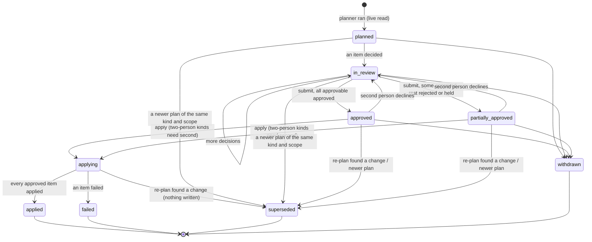

# The approval workflow

This is the core of the console. jason plans a write outside itself. A named person reviews it item by item and approves some or all of it. jason reads the live state again, refuses if anything the approval relied on has changed, applies only what was approved, and records every step.

**Status: built.** The engine is `jason.approvals` (`src/jason/approvals/`), with one action kind, `owner-info-tags`. Its doors:
- **the CLI**, `jason approvals` (built);
- **`jason-mcp`**, `approvals_list` and `approval_show`, read only (built);
- **jason-web**, the `/api/approvals*` routes (`jason.web.approvals`) and `PlanReview` in jason-ui's `#/approvals` (being added; [web-ui.md](../web-ui.md#approvals)). Apply there is off unless the server is started with `--allow-apply` ([architecture.md](architecture.md#the-approvals-engine-behind-jason-web)).

This page is the engine's contract:
- **Names are binding.** The record and field names, the states, and the transitions below are the names the engine uses: `Approval`, `PlanItem`, `Change`, `DecisionRecord`, `Signature`, `ApprovalStatus`, `ItemClass`, `Decision`, `Result`, `ActionKind`, `Approver`, `Risk`.
- **The JSON Schemas in `src/jason/approvals/schemas/` mirror the dataclasses.** If the two ever differ, this page and the schema are corrected together.
- **Where each piece goes.** The screen is [screens/approvals.md](screens/approvals.md), and the components are in [components.md](components.md#approval).

Two other kinds of approval live beside this one and are not the engine's: a **letter's stages** (`jason.tasks.approvals`, [section 11](#11-letters-and-plans-one-inbox)) and the **board's decisions**, which are votes at a meeting and never an approval click ([section 12](#12-the-board-decides-by-vote)).

## 1. The first case: the owner-information cycle

The rest of this page generalizes `jason owner-info --apply --payhoa`, as written today.

**`commands.owner_info._apply`** does the following:
1. It reads PayHOA live: every unit page (`client.list_units`) and every person (`client.iter_people`).
2. It gathers every answer (`_answers`): the saved outside-form responses, and with `--payhoa` the PayHOA form's signed-in submissions (`payhoa_forms.fetch_submissions`), less the test memberships (`config.test_memberships`).
3. It builds the ledger (`_rows` → `owner_info.ledger`).
4. It plans the writes: `owner_info.plan_writes(rows, found, tags, earlier=..., today=...)` returns `Write(kind, target, label, value, why)`. The kinds are `member tag +`, `member tag -`, `unit tag +`, and `unit tag -`. The reasons:
   - the default delivery tag where an owner has no election (Civil Code 4040(a)(2));
   - an earlier written election's tags (`EarlierElections`);
   - a this-cycle answer's tag changes.
5. It drops any `member…` write whose target is a test membership.
6. With `--payhoa`, it **holds for the board** the unit occupancy-tag writes for units whose response the policy flags. Those are `owner_responses.triage(context)` findings with `Outcome.BOARD` and rule `occupancy-vs-tag`. It prints them as "held for the board", and they are never written.
7. It prints the plan. Without `--yes` it stops there. With `--yes` it calls `owner_info.execute(client, org, writes, member_tag_rows=...)`, which batches member additions by tag (25 at a time), removes a tag by its tag-row id, and adds or removes unit tags. It returns counts by kind.
8. With `--payhoa`, it runs `_complete_requests`. For each owner's open PayHOA request (`owner_info.to_complete`), `item.left` lists what is still to do:
   - a write not yet made;
   - something a person enters (`FOR_A_PERSON`: an email, a mailing address, a secondary delivery, a property manager, and the representative fields in `PERSON_FIELDS`);
   - every non-`RECORD` finding of the response policy.

   A request with nothing left is completed with `owner_info.complete`. That marks the submission complete and leaves `OWNER_INFO_COMPLETED_COMMENT`, which is **emailed to the owner** (`recipient_member_ids`). This exception is the board's rule, recorded in AGENTS.md.

**`owner_responses.Outcome`** sorts every finding into one of five classes. The console's item classes map one to one:

| Outcome | Meaning | In an approval |
|---|---|---|
| `RECORD` | jason writes it | An **approvable** item: a tag write |
| `PERSON` | A person enters or removes something in PayHOA | A **for a person** item, never approvable. It holds its request open |
| `CONFIRM` | Ask the owner before relying on it | A **confirm with the owner** item, never approvable here. It holds the request open. Asking the owner is a message, a separate kind |
| `BOARD` | A question of policy | A **held for the board** item, with its `Finding.board_item`. Never approvable |
| `IGNORE` | A test account's answer | Hidden by default, and counted |

Three facts in the code as it was shaped the engine. Each is now fixed, with its guard (the lessons `apply-loses-partial-results`, `complete-only-after-writes`, and `plan-reads-once`):
- `execute` returned counts, not a result for each item, so a failure part-way through lost which writes were made. **Now each write has its own result and audit line** (`owner_info_apply.execute_each`).
- After `execute`, the pending list was cleared, so every planned write counted as made. **Now a write not actually made stays pending**, and its request stays open (`Result.BLOCKED` in an approval).
- One plan read PayHOA three times. **Now a plan reads live once** (`owner_info_apply.ReadOnce`, which also refuses any write while planning), and the triage reuses that read (`owner_responses.contexts(live=...)`).

## 2. Survey: every write jason gates today

There are four ways a write is confirmed today:
- **`--yes`**, a bare confirmation;
- **`--yes --confirmed-by NAME`** on batches, and `jobs add --confirm NAME`;
- **`--by NAME`**, which signs a `data/` record;
- **a second person** (`intake.confirm`, `onboarding_confirm`).

The tables classify every path found by grepping `--yes`, `--confirmed-by`, `--confirm`, and `--by` in `src/jason/cli.py` and `src/jason/commands/`.

**Risk tiers**

| Tier | Meaning |
|---|---|
| **R0** | Local only. It writes under `data/` or the checkout, and can be undone from a backup or by editing |
| **R1** | Private, outside jason. It creates or changes something only the association's own people see, such as a Gmail draft, a private Doc, a calendar event jason made, or a Drive label. A person can undo it |
| **R2** | Member-facing record. It changes what the association's records say about members, or what members will receive or see, such as PayHOA tags, a live form, or a request marked complete. Partly reversible: a tag can be removed, but an email that went out cannot be recalled |
| **R3** | Irreversible, costly, or legal. It sends to members, mails, publishes, or starts a legal process |

**Whose decision**

| Rule | Meaning |
|---|---|
| **M** | The manager's: a routine write the documents and law already call for |
| **BR** | A board decision already made: a rule row authorizes it, and the item recites the row |
| **2P** | A second person must confirm |
| **B** | Only the board. Never approvable |

### PayHOA

| Path | Writes | Tier | Reversible | Cost | Decision | Legal clock |
|---|---|---|---|---|---|---|
| `owner-info --apply --payhoa --yes` | Member and unit tags (`owner_info.execute`) | R2 | Yes: remove or add the tag | None | M; the default mail tag recites 4040(a)(2) | The cycle's deadlines (`AnswerCycle.deadlines`): answers in PayHOA before the annual reports |
| the same, request completion | Submission complete, plus a comment **emailed to the owner** (`owner_info.complete`) | R2 | Status yes; the email no | None | BR: the board's owner-information rule | None of its own |
| `delivery --audit --apply --yes` | Delivery tags so PayHOA's filters find every owner | R2 | Yes | None | M | How notices go under 4040 and 4041 |
| `forms --payhoa KEY --yes` | A new PayHOA form, switched off (`payhoa_forms.create`) | R1 | Yes, while unlinked | None | M | — |
| `forms --payhoa KEY --yes --enable` | The same, switched on for owners | R2 | Turning it off, yes. Answers received stay | None | M | — |
| `forms --payhoa KEY --update --yes` | A live, locked form edited in place, keeping question ids (`payhoa_forms.update`) | R2 | By another update | None | M; 2P if it changes a question owners have answered | The cycle, when it is the owner-information form |
| `forms --payhoa KEY --replace --yes` | Deletes an unlocked form with no submissions and makes it again | R2 | No | None | M. **Refused** for a locked form (`payhoa_forms.lock`) | — |
| `forms --payhoa-test KEY --yes` | Submits answers as the test owner | R1 | Test data | None | M | — |
| `request-links --create THREAD --yes` | Enters an emailed request in PayHOA (never approved, denied, or assigned) | R2 | No: the owner can see it | None | M | It starts the request's clock in PayHOA |
| `broadcast --upload PDF --yes` | A PDF in the library's private Email Attachments folder | R1 | Yes | None | M | — |
| `broadcast --send-sample --yes` | A test copy to the admin's own membership | R1 | No, but only to the admin | None | M | — |
| `broadcast --save-template ID --yes` | Replaces a saved template's subject and body, and drops its attachments | R2 | Only by saving again | None | M | — |
| `broadcast --notice KEY --by NAME --yes` | Keeps the notice's rendered text in `data/notices/KEY/` (`notice_text`) | R0 | Yes | None | Signed | The notice's own clock |
| `mailroom --pdf F --units U --send --yes` | **Prints and mails letters, charged to the association** (`mailroom.send`) | R3 | No: only cancellable while processing | Per billed page plus postage (`payhoa.pricing.PRICING`, `mailroom.page_count`). A sixth billed page adds postage | 2P | The notice's clock, when the letter is a notice |
| `mailroom --cancel ID --yes` | Cancels a letter still processing | R2 | No | Saves the charge | M | The notice's clock: cancelling may miss it |
| `owner-info --email-batch --yes --confirmed-by NAME` | Emails each owner their own copy, as a resumable batch (`jason.batches`) | R3 | No | None | 2P | The cycle, and the notice's clock |
| `owner-info --mail-batch --yes --confirmed-by NAME` | A Mailroom letter to each owner without an email election, as a batch | R3 | No | Per letter, as above | 2P | The same |
| `batches --cancel ID --yes` | Skips a batch's pending items | R0 (ledger), which stops R3 sends | Pending items can be put back | Saves the rest | M | It may leave a notice undelivered |

### Google

| Path | Writes | Tier | Reversible | Decision | Legal clock |
|---|---|---|---|---|---|
| `draft --… --yes`, `draft --edit ID --yes` | A Gmail draft, never sent | R1 | Yes | M | That of the notice it drafts |
| `respond --draft ID --gmail --yes` | An acknowledgment as a Gmail draft in the request's thread | R1 | Yes | M | The request's clock |
| `rule-change KEY --draft-email --yes --by NAME` | The member notice as a Gmail draft, kept in the notice ledger | R1 | Yes | Signed, M | Civil Code 4360(a): 28 days before the decision |
| `hold --notices --yes` | Preservation-notice Gmail drafts | R1 | Yes | M, after counsel | The duty to preserve (counsel) |
| `hold --vault --yes` | A Google Vault matter, with its Drive and Mail holds | R3 | A hold can be released, but releasing early may destroy evidence | 2P, after counsel | The duty to preserve |
| `hold --label --yes` | `jason_hold` on held Drive files | R1 | Yes | M | — |
| `forms --create KIND --yes` | A Google Form, unpublished | R1 | Yes | M | — |
| `forms --publish ID --yes` | **Anyone with the link can answer** | R3 | Unpublishing, yes. Answers received stay | 2P | — |
| `calendar --yes` | Creates or patches jason's own events. Never deletes, and never changes another's event | R1 | Yes | M | Shows clocks; sets none |
| `schedule --calendar --yes`, `schedule --tasks --yes` | All-day events, and Tasks on each role's list | R1 | Yes | M | Shows clocks |
| `templates --build/--rewrite/--generate --yes` | Template Docs (`--rewrite` replaces a body) | R1 | Through Drive revisions | M | — |
| `letter --yes` | A filled copy of a template | R1 | Yes | M | — |
| `board --agenda --doc --yes`, `board --packet --doc --yes` | The agenda or packet as a private Doc | R1 | Yes | M | 4920: the notice date the agenda carries |
| `report KEY --doc --yes` | The report's own Doc, plus a packet run's PDF | R1 | Through Drive revisions | M | — |
| `packet --make-templates --yes`, `packet --build --yes` | Template Docs, filled copies, and the merged PDF | R1 | Yes | M | The annual disclosures' window (5300) |
| `hearing --doc --yes` | The notice of hearing as a Doc | R1 | Yes | M | 5855: notice before the hearing |
| `registers --create KEY --yes` | A register Sheet | R1 | Yes | M | — |
| `drive-labels --apply --yes` | jason's appProperties on Drive files | R1 | Yes | M | — |
| `photos --publish/--to-drive SLUG --yes` | An album jason created; copies in Drive | R1 | Yes | M | — |

### Zoom, local, and the machine

| Path | Writes | Tier | Decision | Legal clock |
|---|---|---|---|---|
| `hearing --create --yes` | A Zoom meeting on the association's account | R3. The hearing date starts the notice clock | 2P | 5855 |
| `spec --migrate --yes` | Copies private-fact topics into the profile's folder, after a backup; no source changes | R0 | M | — |
| `living --use-reread R --yes --by NAME` | Switches a scanned base to a re-read | R0. It changes the words jason recites | Signed. **Treat as 2P**: it is an `intake.HIGH_STAKES` kind of decision (which words are in force) | — |
| `section-refs --apply PATH --yes` | Writes a proposal's tokens into a file | R0 | M | — |
| `intake --answer/--confirm/--apply`, `onboard --answer/--confirm/--apply` | Answers, a second person, records, private facts with a backup and a diff, and profile proposals as patches under `data/onboarding/proposals/` | R0. A private-fact merge is P3 data | Signed. 2P for `high_stakes` answers. A proposal is applied by a person with `git apply` | The clock the answer sets, when it sets one (`FactAsk.clock`) |
| `ingest SOURCE --apply` | Copies files into `data/library` and `library.db` | R0 | M | — |
| `jobs add --confirm NAME -- CMD --yes` | Queues a write for the worker | As the command | As the command. The job keeps the name | As the command |
| `anythingllm --start/--stop/--apply/--reembed --yes`, `local-ai --restart-ollama/--unload --yes` | The machine's own services, not the association's records | Ops | M | — |

### Writes with no gate today

These are findings for later, not part of this spec (the lesson `google-writes-without-yes`, open). Each should get a dry run and `--yes`, then a registry row, before the console offers it:
- `board --sheet`, `board --create-sheet`, and `board --tasks` write the board's Google Sheet and Tasks without `--yes`.
- `property-history --sheet` creates a spreadsheet without `--yes`.
- `request-comment` posts a PayHOA comment that PayHOA emails to the owner, with no dry run or `--yes`.
- `board --set` and `schedule --done --by` write local records. Signed, they are fine as R0.

## 3. The `Approval` record

As built in `jason.approvals.model`. Enum values are stored as their snake-case words and turned back into members on load, the way AGENTS.md asks.

```python
class ApprovalStatus(Enum):
    PLANNED = "planned"                        # jason made the plan; nobody has decided an item
    IN_REVIEW = "in_review"                    # at least one item decided, not yet submitted
    APPROVED = "approved"                      # submitted: every approvable item approved
    PARTIALLY_APPROVED = "partially_approved"  # submitted: some approved, the rest rejected or held
    APPLYING = "applying"                      # the re-plan matched; writes under way
    APPLIED = "applied"                        # every approved item applied
    FAILED = "failed"                          # one or more approved items failed; waits for a person
    SUPERSEDED = "superseded"                  # the live state changed, or a newer plan replaced it
    WITHDRAWN = "withdrawn"                    # withdrawn before apply, or nothing was approved


class ItemClass(Enum):
    APPROVABLE = "approvable"
    HELD_FOR_BOARD = "held_for_board"          # Outcome.BOARD: a question of policy, never approvable
    FOR_A_PERSON = "for_a_person"              # Outcome.PERSON: a person does it in the system itself
    CONFIRM_WITH_OWNER = "confirm_with_owner"  # Outcome.CONFIRM: ask the owner first; a message is its own kind
    INFORMATIONAL = "informational"            # what follows: a request that stays open, and why


class Decision(Enum):
    UNDECIDED = "undecided"
    APPROVED = "approved"
    REJECTED = "rejected"                      # a person leaves it out; a reason is required
    HELD = "held"                              # a person holds it for the board; a reason is required


class Result(Enum):
    PENDING = "pending"
    APPLIED = "applied"
    NOT_APPLIED = "not_applied"                # rejected, held, never approvable, or not attempted
    CHANGED = "changed"                        # refused at apply: its basis moved since review
    BLOCKED = "blocked"                        # something it waits on was not applied
    FAILED = "failed"
    UNCERTAIN = "uncertain"                    # the request went out and no answer came back: verify first


@dataclass(frozen=True)
class Change:                                  # what the item changes, for the before -> after row
    op: ChangeOp                               # ADD, REMOVE, SET
    field: str                                 # "member tags", "unit tags", "request status"
    value: str = ""
    before: str = ""
    after: str = ""


@dataclass(frozen=True)
class Evidence:
    label: str                                 # "PayHOA request 1234", "Civil Code 4040(a)(2)"
    address: str = ""                          # a citation jason cite resolves, a command, or a record's address


@dataclass
class PlanItem:
    id: str                                    # stable: item_id(kind, op, target, value)
    op: str                                    # the kind's verb: "member tag +", "complete request"
    target: str                                # "member:123", "unit:45", "submission:678"
    label: str                                 # who or what, for the reader: "Unit 12: Owner A"
    value: str                                 # the tag, the status, the text
    why: str                                   # the planner's reason
    group: str = ""                            # the items read together: one owner
    change: Change | None = None
    rule: str = ""                             # the rule that calls for it: a citation or a rule row's address
    evidence: tuple[Evidence, ...] = ()
    basis: str = ""                            # sha256 of the live state this item relies on
    klass: ItemClass = ItemClass.APPROVABLE
    board_item: str = ""                       # held for the board: the board item it waits on
    depends_on: tuple[str, ...] = ()           # item ids that must apply first (a completion on its writes)
    high_stakes: bool = False                  # a second, distinct person must sign before it applies
    cost_cents: int = 0                        # what applying it charges the association
    decision: Decision = Decision.UNDECIDED
    decided_by: str = ""
    decided_at: str = ""
    reason: str = ""
    result: Result = Result.PENDING
    result_detail: str = ""


@dataclass(frozen=True)
class DecisionRecord:                          # one decision as made, kept in order on the approval
    by: str
    at: str
    items: tuple[str, ...]
    decision: Decision
    reason: str = ""
    fingerprint: str = ""                      # the plan fingerprint it was made on
    via: str = "cli"                           # "cli" or "console"


@dataclass(frozen=True)
class Signature:
    name: str                                  # the named person
    at: str                                    # UTC, ISO 8601, seconds
    fingerprint: str                           # the plan fingerprint signed
    role: str = "manager"
    via: str = "cli"


@dataclass
class Approval:
    id: str                                    # "apr-" + UTC stamp + 4 hex: apr-20990101T120000-1a2b
    kind: str                                  # an ActionKind key: "owner-info-tags"
    title: str
    items: list[PlanItem]
    fingerprint: str                           # plan_fingerprint(kind, scope, items)
    read_at: str                               # when the live state was read
    requested_by: str
    requested_at: str
    requested_via: str = "cli"
    scope: dict = field(default_factory=dict)  # the planner's arguments
    profile: str = ""                          # the active profile's name when planned
    status: ApprovalStatus = ApprovalStatus.PLANNED
    evidence: tuple[Evidence, ...] = ()
    decisions: list[DecisionRecord] = field(default_factory=list)
    first: Signature | None = None             # who submitted the decisions
    second: Signature | None = None            # the second person, where one is needed
    cost_cents: int | None = None              # None when the kind has no cost
    clock: dict | None = None                  # the legal clock it serves: {"what", "due", "daysLeft"}
    summary: dict = field(default_factory=dict)
    result: dict = field(default_factory=dict) # after apply: counts by result; after a refusal: what changed
    supersedes: str = ""
    superseded_by: str = ""
    notes: list[str] = field(default_factory=list)   # "2 approvable item(s) new since review, not included"
```

**The store.** One JSON file per approval, `data/approvals/<id>.json` under the active profile's data folder, written whole (a temporary file, then a replace) under the store lock, never checked in. The audit log is `data/approvals/audit.jsonl` beside them. The earlier plan for a SQLite `approvals.db` under a console folder was not built; the lesson `approvals-store-location` holds it as a decision until a person confirms the JSON store ([mvp.md](mvp.md#open-decisions)). The letters' store, `data/approvals/letters.json`, shares the folder and the lock key ([section 11](#11-letters-and-plans-one-inbox)).

**Held items and items for a person** are items with their class set. They are stored, shown in their own sections, and counted. They are never decided: `decide` refuses them by name ("held for the board (board item …): never approvable"). Keeping them in the record means the approval is the full picture a person reviewed, not just the writes.

**Evidence.** The planner attaches its evidence as `{label, address}`: the PayHOA submission, the rule as a citation, the board item, the ledger row. A record the plan read live also carries `readAt` and `digest` (what was read, as a sha256), and the plan keeps what it read beside the approval ([Evidence you can open](#evidence-you-can-open)). A label is a name and a tag at most; an email address in any field is masked before the record or the log is written.

**Secrets.** The planner refuses an item whose value `intake.secret_reason` flags, and an approvable item with no basis ("an apply could not tell whether it changed").

### Evidence you can open

An evidence address resolves back to the record from disk (`jason.approvals.evidence.resolve`; `GET /api/evidence?address=...&approval=...` in jason-web, the `evidence` tool in jason-mcp's governance profile). **Nothing is read live when evidence is opened:** each copy jason holds is listed with when it was read, and the commands that read it again are offered beside it, each marked `live` with the system it reads.

| Address | What it reads | Refresh |
|---|---|---|
| `payhoa:submission:N` | **This plan's read**: the request's status and answers as the plan read them, from `data/approvals/<id>.evidence.json`. **Last read from PayHOA**: the latest full read of the submission, whoever made it, from `payhoa-files/requests/N/submission.json`: its status, form, unit, and answers by question title. **PayHOA catalog**: the `requests` row as last synced (status only, never answers). **Request files**: the counts of the comments, internal notes, and attachments saved in `payhoa-files/requests/N/` | `jason approvals apply ID` (re-reads PayHOA and compares, writing nothing), `jason sync-request-files --requests N` (re-reads the request in full: its answers, comments, notes, and attachments), `jason sync-catalog --only requests`: all live. The panel's refresh button reads just this request again |
| a citation (`CIV 4041`, `decl#6.2(a)`) | The words recited from disk (`jason cite`), with the version in force and their caveat; never a paraphrase | `jason export-authorities` (the statutes, from lawlibrary) |
| `board-item:ID` | The item in `data/board/items.json`; an executive-session item's summary and notes are held back | `jason board`; `jason board --sheet` (Google) |
| `jason ...` | Nothing: the command is what produced the evidence | the command itself |

Which reader answers is the first rule row whose matcher takes the address (`evidence.RULES`); an address none takes is `found: false`, kind `unknown`, with the reason. A copy that is not on disk is left out of `sources`, and `note` names the command that fills it.

**The snapshot.** The owner-information plan reads PayHOA's form submissions live and keeps no other copy, so the planner keeps one: each request its evidence names, with its status, unit, and answers (each answer flagged P2 when it is an owner's contact detail or reported occupancy), stamped with the plan's read time and the same digest the item's evidence carries. The engine writes it beside the approval under the store lock, once, when the plan is stored; a re-plan's snapshot goes with the new approval. An approval made before snapshots, or one whose kind reads nothing live, has none, and its evidence still opens from the other copies.

**The last read.** The catalog lists requests and never holds their answers, so jason also keeps the latest full read of each submission: `payhoa-files/requests/N/submission.json` (`jason.tasks.submission_cache`), `{readAt, via, formId, formName, status, submission}` with the submission as PayHOA answered it. Whatever reads a submission in full replaces it, written whole (a temporary file, then a replace): every owner-information plan as it reads (`owner_info_apply.gather_answers`, so `jason approvals plan owner-info-tags` and `jason owner-info --apply` refresh it), `jason sync-request-files` (one full read a request, beside its comments, notes, and attachments), and a person's refresh from the panel. Its answers are read by the form's definition where the profile has one, so they are shown by question title, masked by the same P2 rule as the snapshot, and carry the same digest; a form the profile does not define shows PayHOA's own labels, masked by name, and is not compared.

**Changed.** `changed` compares the plan's read with a later local copy where the two can be compared: the last read from PayHOA (its status, and its answers' digest against the snapshot's), and the catalog's status when it was synced after the plan. `true` when either shows a change, `false` when one compares and none shows a change, each said in `changedNote` with what differs; `null` when it cannot tell (no later copy, or each was read before the plan). Whether the request changed in PayHOA since is what `jason approvals apply ID` answers.

**Refreshing one record.** A person refreshes one piece of evidence from the panel: `refreshable` names the system and what the button does (null for a kind that has none: a citation, a board item, a command). `POST /api/evidence/refresh` with `{address, approval?, by}` reads that one record from PayHOA live, under the person's name (the signed-in officer, or the name the page sends), and answers the fresh evidence with `refreshed: {at, by, system}`. It writes only jason's own cache (`submission.json`, `via` "console refresh by NAME", under the store lock) and one audit line in `data/evidence/refreshes.jsonl` (when, who, which address, the system, and whether it worked; never the answers). It never writes to PayHOA. It sits behind the write guard with the token in its header, is refused while an admin is viewing as someone else, and never asks for a credential: when Keeper is not signed in it answers 409, "Keeper is not signed in; run `jason login` in a terminal, then refresh again." A kind with no refresher, or no person, is 400. "Read every request again" in the plan's header (`POST /api/evidence/refresh-all` with `{approval, by}`, `evidence.refresh_all`) reads every distinct refreshable address of one plan on one sign-in under one hold of the lock, a line each in the same log, and answers `{approval, by, at, refreshed, failed: [{address, error}], skipped}` (never the answers; the page reloads the panels it has open): a read that fails is listed and the rest go on, Keeper not signed in is 409 before any read, and more than 200 addresses is refused. jason-mcp has no refresh: its `evidence` tool stays read-only.

**Viewing the document.** Each answer lists the documents behind the evidence in `documents: [{id, name, kind, size, readAt, note}]`: names and sizes, never contents (`jason.approvals.evidence_documents`). For a request, the submission as last read (`submission`) and each attachment `jason sync-request-files` saved in its folder (never its comments, notes, or `submission.json`). For a citation, the whole section as stored (`section`) and, where `jason cite` names the governing document's file (a library path, or a Drive file the Drive holdings place on disk) and the library does not hold it as confidential, that file and its extracted text. A board item or a command lists none. `kind` comes from the extension alone: `pdf`; `png`, `jpg`, `jpeg`, `gif`, `webp` as `image`; `txt`, `md`, `csv` as `text`; anything else, HTML, SVG, and XML included, is `file`. Opening one is the ask that principle 6 of the [console README](README.md) names: `POST /api/evidence/view` with `{address, approval?, document, by}` shows it **unmasked** for the named person and appends one line to `data/evidence/views.jsonl` (`at`, `by`, `address`, `document`, `kind`; never the contents). It is never automatic: it sits behind the write guard with the token in its header, is refused while an admin views as someone else, and an empty `by` is 400; a document the address does not list, or a file gone from disk, is 404. A submission comes back as `{form, unit, submitted, status, questions: [{question, answer, kind}]}` in the form's own order (each answer's question and its `sortOrder`; dividers left out; choices joined with "; ", dates as YYYY-MM-DD, a file as its name), a text whole, and a pdf, an image, or another file as a link, `GET /api/evidence/document/<token>`, good for ten minutes and many reads (a PDF viewer asks for ranges), held in memory only. The link serves the file from disk, path-checked inside its folder, with `nosniff`, `no-store`, and `Content-Security-Policy: sandbox; default-src 'none'; img-src 'self'; style-src 'unsafe-inline'` (Chromium's PDF viewer still renders it in an iframe); a `file` is always an attachment, never inline. The caveats begin "Unmasked: shown because NAME asked; this view is logged." jason-mcp has no view: it stays read-only and masked (`read_exported_file` reads a saved file).

**Privacy.** The snapshot and the last read hold answers as read (P2, as the catalog does), on local disk only. An owner's email, phone, and mailing address, and an answer flagged P2, are masked by the server before they leave it (`masked: true`); a citation's words are quoted as stored. The response's caveats include "Evidence, not a finding."

### Fingerprints

- **The item id** is `sha256(f"{kind}|{op}|{target}|{value}")[:16]` (`item_id`). It is the same on every re-plan for the same write.
- **The basis** is a sha256 over a canonical serialization of what the item relies on, read live:

  | Item | Its basis |
  |---|---|
  | A member tag | the member's tag rows |
  | A unit tag | the unit's tags |
  | A request completion | the submission's status, its answers, and the triage findings |
  | A Mailroom send (proposed) | the PDF's sha256, the resolved recipients' ids, and PayHOA's addresses for them |

- **The plan fingerprint** is `sha256` over the canonical JSON (sorted keys, no spaces) of `{"kind", "scope", "items": sorted([id, basis] for approvable items)}` (`plan_fingerprint`), shown as its first 12 hex digits.
- **The basis fingerprint** is the same over the approved items only (`basis_fingerprint`); `check` and `apply` compare it before and after the re-plan.
- A signature records the fingerprint it signed. A second person signs **the same** fingerprint, or nothing.

## 4. The state machine



| From | Event | To | Guard |
|---|---|---|---|
| — | plan | planned | The kind's planner ran on a live read. If an open approval of the same kind and scope exists, it becomes superseded |
| planned, in review | decide an item | in review | The item is approvable. A rejection or a hold needs a reason |
| in review | submit (name) | approved (every approvable item approved), or partially approved (some approved, the rest rejected or held) | Every approvable item is decided: approved, rejected, or held, and no approved item waits on one that is not. At least one is approved; if none is, the approval becomes **withdrawn**, with "nothing approved". Its holds still go to the board ([section 12](#12-the-board-decides-by-vote)) |
| approved, partially approved | second-person confirm (name) | unchanged; `second` set | A second person is needed: a two-person kind, or a high-stakes approved item (`needs_second`). The name differs from `first.name` and from `requested_by` (casefold, trimmed) |
| approved, partially approved | second-person decline (name, reason) | in review | The decisions are kept and `first` is cleared. The first person must submit again |
| approved, partially approved | apply (name) | applying | Submitted; `second` set where one is needed; the plan is no older than the kind's `max_age_hours`. From jason-web, only when the server's apply flag is on |
| applying | re-plan differs | superseded | Nothing is written. A new approval is made from the re-plan, with `supersedes` set |
| applying | done | applied, or failed | — |
| any but applying and terminal | withdraw (name, reason) | withdrawn | — |

**Approved and partially approved** are separate states because a reader of the log must see at a glance that a person chose to leave writes out.

The table is `model.TRANSITIONS`; `model.transition` is the only way a status changes, and it refuses a move the table does not allow.

**Terminal states are final.** A failed approval is never retried automatically, which is the rule `jason.jobs` keeps for writes. A person reads why, plans again, and approves the new plan.

## 5. Approval by item

- **Items are approved one by one.** "Approve all approvable" is a shortcut that sets each one; the log records each item's decision.
- **The default is undecided**, never approved. Nothing is pre-checked.
- **A rejection needs a reason** of a few words: "owner called; wants email". The reason goes in the log.
- **A person can hold an approvable item for the board** (`Decision.HELD`). This is for a write the rules allow but the person thinks the board should see first.
  - It needs a reason, as a rejection does.
  - The item is not written.
  - Unlike the planner's `HELD_FOR_BOARD` class, a person's hold is a decision, and is logged as one.
  - Where it goes next is [section 12](#12-the-board-decides-by-vote): a board item, then the meeting's agenda. **As built, the engine records the hold and its reason only**; proposing the board item on submit (`tasks.board_items.propose`, signed by the person) is still to build, and until it is, the screen shows the `jason board` command that proposes it.
- **Groups.** Items are grouped by target, such as a member, or a unit and its members. One person's changes read together.
  - A group can be approved or rejected at once.
  - A dependent item (a request completion) sits in its target's group, and shows which writes it waits on.
- **What follows a rejection.** A rejected write leaves its request open. Approving a completion whose writes are not all approved is refused ("waits on …: approve those first"), and rejecting or holding a write makes an approved completion that waits on it undecided again. At apply, a completion whose writes did not all apply is `Result.BLOCKED`.
- **Items for a person** come with the task they need: "enter the mailing address in PayHOA" for that owner. They link to the owner in PayHOA's own interface (the `jason party` link). There is no checkbox, because jason does not do them.

## 6. Re-plan before apply

Apply always re-reads. It never trusts the stored plan's live state.

1. Hold the approval's own lock (`hold(Resource.STORE, "approval-<id>")`), so one apply runs at a time. Refuse, and log `apply.refused`, if:
   - it is not approved or partially approved, or not submitted;
   - a second person is needed and has not signed;
   - `read_at` is older than the kind's `max_age_hours`.
2. Take the kind's resource lock for the whole re-plan and apply (`hold(Resource.PAYHOA, "approval-<id>")` for a PayHOA kind). This is the pattern `jason.batches` uses.
3. Run the kind's planner again with the same `scope`, on one live read.
4. Compare each **approved** item with the re-plan:
   - **Same id, same basis, still approvable:** it goes ahead.
   - **Missing, a different basis, or now held** (a new board finding, for instance): the item is `CHANGED`.
5. If any approved item is `CHANGED`, **refuse the whole apply**. Nothing is written. Then:
   - the approval becomes `superseded`;
   - the log records the changed items, with the old and new basis;
   - a new approval is made from the re-plan, with `supersedes` set.

   The new approval shows the earlier decisions as hints ("approved earlier by A Person"). It does not count them. This is GitHub's dismissal of stale approvals, applied item by item, and Terraform's stale-plan refusal applied to the approved set.
6. Items that are **new** in the re-plan do not block an apply, because they were never approved. The log notes them ("3 writes new since review, not included"), and they wait for the next plan.
7. Write each approved item through the kind's applier:
   - log the intent first (`item.applying`), then the result, as `batches` marks an item sending before its request;
   - an item cut off mid-request is `UNCERTAIN`, and the next plan's live read settles it;
   - a dependent item applies only when every item it depends on is `APPLIED`, and the kind's own re-check passes. For a completion, `to_complete` is run with the writes not applied as pending, and `left` must be empty.
8. Finish:
   - every approved item `APPLIED`: the approval is `applied`;
   - otherwise: `failed`, with each failed item's error.

Why refuse the whole apply, rather than apply the unchanged part? A partial picture is what a person did not review. When an owner submits a new answer between review and apply, every write for that owner may need to change, and the reviewer should see that. A re-plan takes seconds. A person's attention is what is scarce.

## 7. The second-person rule

A **two-person (2P) kind** needs two signatures on the same fingerprint.

**Who signs**
- The **first** person submits the decisions.
- The **second** person reviews the same plan and confirms. They cannot change a decision: a change is a decline, which sends the approval back to review.

**What is refused**
- The second name may not equal the first signer's name or the requester's. Names are compared casefold and trimmed, as `intake.confirm` does.
- The console shows the refusal; it does not merely warn.

**What lapses**
- Any re-plan that changes the fingerprint clears both signatures, because the new plan is a new approval.

**When a second person is needed** (`engine.needs_second`): the kind's `approver` is `TWO_PERSON`, or any approved item is `high_stakes`. A one-person kind can still carry a high-stakes item.

**Which kinds are proposed as 2P** (none is built yet; the registry's `approver` column below):
- sends to members, by email or mail;
- money: Mailroom postage;
- publishing to anyone with a link;
- legal process: Vault holds, a hearing scheduled;
- a change to which words are in force: `living --use-reread`, and the high-stakes intake kinds.

**The limits, stated plainly**
- Until sign-in exists, a name is self-asserted: a `--by` in the terminal, or the "Signed in as" pick in jason-web. The rule then guards against mistakes, not against a determined person.
- The log records the operating-system user beside each name (`os_user`), so a misuse leaves a trace ([security-and-privacy.md](security-and-privacy.md#identity)).
- Sign-in for each person, a later phase, makes the names authenticated.

## 8. The action-kind registry

A kind is a row, not a branch in the console. The registry is `jason.approvals.registry`: the built rows in `KINDS`, plus any a module or a test adds with `register`. Adding a `--yes` path to approvals means adding a row, plus a planner and an applier that call the task functions the CLI already calls.

```python
class Risk(Enum):
    R0 = "local"
    R1 = "private outside jason"
    R2 = "member-facing record"
    R3 = "irreversible, costly, or legal"


class Approver(Enum):
    ONE_PERSON = "one person"    # one named person decides and submits; a high-stakes item still needs a second
    TWO_PERSON = "two person"    # a second, distinct person signs the same fingerprint before any apply


@dataclass(frozen=True)
class ActionKind:
    key: str                     # "owner-info-tags"
    title: str
    cli: str                     # the command it stands beside: "jason owner-info --apply --payhoa --yes"
    system: str                  # "payhoa", "google", "zoom", "local": what the live read needs
    resource: Resource           # the lock held during apply
    risk: Risk
    approver: Approver
    reversible: str              # "tags: yes, ...; the comment emailed to the owner: no"
    planner: str | Callable      # "module:function": planner(live, scope) -> Planned, read only
    applier: str | Callable      # applier(live, planned, items, recorder): only the approved items
    cost: str = ""               # how its cost is shown; "" for none
    clock: str = ""              # the clock it serves
    rule: str = ""               # the rule that authorizes it, where one does
    max_age_hours: int = 24      # an approval older than this is planned again before apply
    default_scope: dict = field(default_factory=dict)
    aliases: tuple[str, ...] = ()
```

The earlier spec had four approver rules. As built there are two, and the other two are carried differently:
- **A board rule** is not an approver. A kind the board's rule authorizes is `ONE_PERSON`, names the rule in `rule`, and each item it covers recites it in `PlanItem.rule`.
- **A signed `data/` record** (an intake answer, a completion recorded with `by`) is not an engine kind at all. It is the task's own write with `by`, logged where the task logs it.

**Built.** One row:

| Key | Covers | Risk | Approver | Reversible | Clock | Rule |
|---|---|---|---|---|---|---|
| `owner-info-tags` (alias `payhoa.owner-info.tags`) | The owner-information cycle's PayHOA member and unit tags, and the request completions that follow them (`jason owner-info --apply --payhoa --yes`) | R2 | one person | Tags yes; a completed request's status yes; the comment emailed to the owner no | The owner-information cycle (Civil Code 4040, 4041) | The board's owner-information completion rule |

**Proposed.** Each row waits on its planner and applier. The CLI path for each is in the survey above. "One person, rule" means `ONE_PERSON` with the authorizing rule recited.

| Key | Risk | Approver | Reversible | Cost shown | Clock |
|---|---|---|---|---|---|
| `payhoa.delivery.tags` | R2 | one person | Yes | — | 4040, 4041 |
| `payhoa.form.create` | R1 | one person | Yes, while unlinked | — | — |
| `payhoa.form.update` | R2 | one person; a high-stakes item when a question with answers changes | By another update | — | The cycle |
| `payhoa.form.test-submit` | R1 | one person | Test data | — | — |
| `payhoa.request.create` | R2 | one person | No | — | The request's kind |
| `payhoa.broadcast.upload` | R1 | one person | Yes | — | — |
| `payhoa.broadcast.sample` | R1 | one person | To the admin only | — | — |
| `payhoa.broadcast.template` | R2 | one person | By saving again | — | — |
| `payhoa.mailroom.send` | R3 | two person | No | Pages × price, plus postage, from PayHOA's preview and `payhoa.pricing` | The notice's |
| `payhoa.mailroom.cancel` | R2 | one person | No | The charge saved | The notice's |
| `payhoa.owner-info.email-batch` | R3 | two person | No | — | The cycle, and the notice's |
| `payhoa.owner-info.mail-batch` | R3 | two person | No | Per letter, as above | The cycle, and the notice's |
| `batches.cancel` | R0 | one person | Pending items can be restored | — | The notice's |
| `gmail.draft` (covers `draft`, `respond --gmail`, `rule-change --draft-email`, `hold --notices`) | R1 | one person | Yes | — | The draft's notice or request |
| `google.form.create` | R1 | one person | Yes | — | — |
| `google.form.publish` | R3 | two person | Unpublishing; answers stay | — | — |
| `google.calendar` (covers `calendar`, `schedule --calendar`) | R1 | one person | Yes | — | — |
| `google.tasks` (`schedule --tasks`) | R1 | one person | Yes | — | — |
| `google.doc` (covers templates, letter, board doc, report doc, packet, hearing doc) | R1 | one person | Through revisions | — | That of the document |
| `google.sheet.register` | R1 | one person | Yes | — | — |
| `google.drive.labels` | R1 | one person | Yes | — | — |
| `google.photos` | R1 | one person | Yes | — | — |
| `google.vault.hold` | R3 | two person | Release, with counsel | — | The duty to preserve |
| `zoom.hearing.create` | R3 | two person | Deleting a meeting does not undo a notice sent | — | 5855 |
| `local.spec.migrate` | R0 | one person | From the backup | — | — |
| `local.living.reread` | R0 | two person | Switch back | — | — |
| `local.section-refs.apply` | R0 | one person | Edit the file | — | — |
| `local.ingest.apply` | R0 | one person | Remove the rows | — | — |

Not engine kinds: `intake --answer` and `--confirm` (a signed record; a second person for a `high_stakes` answer, through `intake.confirm`), and `schedule --done --by` (a signed record). Machine operations (`anythingllm`, `local-ai`) are not association records, and stay in the CLI.

A letter jason drafts from a template (`google.doc`) has a second, earlier approval of its own: the letter's stages ([section 11](#11-letters-and-plans-one-inbox)). That approval is of the words; this one is of the write.

### What never appears as approvable

There is no approve control for any of these, at any phase:
- an item held for the board (`Outcome.BOARD`), or any question no rule row answers ([section 12](#12-the-board-decides-by-vote));
- an item for a person (`Outcome.PERSON`) or for the owner to confirm (`Outcome.CONFIRM`);
- a write on a test membership (`config.test_memberships`). It is dropped before the plan;
- what jason never does (AGENTS.md boundaries):
  - approving, denying, or assigning a member's request;
  - submitting to a collection agency;
  - deleting a live or locked PayHOA form;
  - editing or deleting an owner's submission;
  - sending a broadcast to members;
  - mailing a letter nobody asked for;
- secrets: no item carries a password, token, PIN, or account number, and the planner rejects a value that `intake.secret_reason` flags;
- a profile change: proposals stay patches under `data/onboarding/proposals/`, applied by a person with `git apply`.

## 9. The audit log

`data/approvals/audit.jsonl` is append-only, private, and never checked in. One canonical JSON object per line (`jason.approvals.audit`), appended under its own lock (`approvals-audit`):

```json
{"seq": 41, "at": "2099-01-01T12:00:03+00:00", "event": "item.applied", "os_user": "manager",
 "approval": "apr-20990101T115500-1a2b", "kind": "owner-info-tags", "actor": "Jane Example", "via": "console",
 "item": "3f9c0a7e5b2d4c18", "op": "member tag +", "target": "member:123", "label": "Unit 12: Owner A",
 "value": "Notices: mail", "basis": "c41d...", "fingerprint": "9e2f4b7c1d0a...", "result": "applied",
 "prev": "the hash of line 40", "hash": "sha256 of this line without hash"}
```

Empty fields are left out of a line.

**Events** (`audit.EVENTS`; an unknown event is refused)
- `plan.created`, `plan.failed` (a live read that could not be made, and why);
- `item.decided`, `approval.submitted`, `approval.confirmed`, `approval.declined`;
- `apply.started`, `apply.refused` (with the changed items, or the reason it could not start);
- `item.applying`, `item.applied`, `item.failed`, `item.uncertain`, `item.blocked`, `item.not_applied`;
- `approval.applied`, `approval.failed`, `approval.superseded`, `approval.withdrawn`;
- `cli.applied`: a `--yes` from the CLI, with a fingerprint of what it wrote.

Proposed with the data levels, not built: `reveal` (a masked field shown, by its kind and never its value) and `private_view.on` / `.off` ([security-and-privacy.md](security-and-privacy.md#data-levels)). The earlier spec's session and token events went with the withdrawn token sign-in.

**Rules**
- **Append only.** No code path rewrites or deletes a line. Every line carries the hash of the line before it, so an edit breaks the chain. `jason approvals audit --verify` walks the chain and names the first break. This makes tampering detectable, not impossible. Copying the log off the machine with the backups is the board's choice.
- **The log holds names and tags, never contact details.** An email address in any field is masked (`[email]`) before the line is written. A mailing address or an account number is never put in an item.
- **The existing ledgers are kept.** jason's own ledgers record the same sends: `data/batches.db` events, `data/mailroom/sent.jsonl`, the notice text in `data/notices/KEY/`, and `confirmed_by` in `data/jobs.db`. The audit log links to them by id and replaces none of them.
- **A `--yes` from the CLI is logged too.** `jason owner-info --apply --payhoa --yes` writes one line a write and a completed request, then `cli.applied`, with `via: "cli"` and the person from `--by` (or `--confirmed-by`), else the operating-system user. The log is whole whichever door wrote to PayHOA.
- **The letters keep their own trail.** A letter's stages are logged on the letter (`log`), not here ([section 11](#11-letters-and-plans-one-inbox)).

## 10. CLI and MCP parity

### CLI: `jason approvals` (built)

| Command | Does |
|---|---|
| `jason approvals` | Lists approvals, open ones first (`--status`, `--kind` filter) |
| `jason approvals kinds` | The registry: each kind's key, risk, approver, and reversibility |
| `jason approvals plan KIND --by NAME` | Runs the kind's planner on a live read and stores the approval. Writes nothing outside jason |
| `jason approvals show ID [--json]` | The items by section: to decide, held for the board, for a person, confirm with the owner, what follows; the decisions, signatures, clock, and cost |
| `jason approvals decide ID --items ITEM... \| --all [--reject \| --hold --reason TEXT] --by NAME` | Decides items. Approve is the default; reject and hold need `--reason` |
| `jason approvals submit ID --by NAME` | Signs the decisions |
| `jason approvals confirm ID --by NAME` | The second person. Refused for the first signer and the requester |
| `jason approvals decline ID --by NAME --reason TEXT` | The second person declines: back to review |
| `jason approvals apply ID` | Re-plans live and shows whether anything changed since review, **writing nothing** (`engine.check`) |
| `jason approvals apply ID --yes --by NAME` | Applies only the approved items, or supersedes the approval with a new plan and writes nothing. Queueable: `jason jobs add --confirm NAME -- approvals apply ID --yes --by NAME` |
| `jason approvals withdraw ID --by NAME --reason TEXT` | Withdraws |
| `jason approvals audit [ID] [--verify]` | Reads the log, and checks the chain |

An approval or an item can be named by a unique prefix (at least 6 characters for an item), as git names a commit.

### MCP (built)

`jason-mcp` stays a reader of disk that never calls PayHOA, Google, or Keeper (AGENTS.md). The `governance` profile serves three read-only tools:
- `approvals_list(status, kind)`: each approval's id, kind, status, counts by class, how many approved, and who asked;
- `approval_show(id)`: one approval as stored, with its audit entries;
- `evidence(address, approval_id)`: one evidence address opened from disk ([Evidence you can open](#evidence-you-can-open)).

An assistant can explain a plan to a person, cite its rules, and say what is held for the board.

**No MCP tool decides, submits, confirms, or applies.** An approval is a person's act at the console or in the terminal. It is never an assistant's tool call, even one a person asked for in chat. A model can read text in a document that tells it to approve something, so this is the one write `jason-mcp` must not have.

### jason-web (being added)

`jason.web.approvals` calls the same engine functions with `via: "console"`, and the name from "Signed in as" as `by` ([architecture.md](architecture.md#the-approvals-engine-behind-jason-web) has the route table):
- reads: `GET /api/approvals` (the letters inbox as before, with the engine's approvals beside it), `GET /api/approvals/<id>`, `GET /api/approvals/audit`, and `GET /api/evidence?address=...&approval=...` (disk only; a miss is 200 with `found: false`);
- `POST /api/approvals/<id>/check`: `engine.check`, a live read that writes nothing, behind the write guard's token header;
- `POST /api/evidence/refresh`: one piece of evidence read again live for the person and kept in jason's cache, never written to PayHOA ([Evidence you can open](#evidence-you-can-open)), behind the same header;
- `POST /api/evidence/refresh-all`: every refreshable piece of one plan's evidence read again on one sign-in, the same way, behind the same header;
- `POST /api/evidence/view`: one document behind a piece of evidence shown unmasked for the named person and logged, behind the same header; a file comes back as a ten-minute link, `GET /api/evidence/document/<token>` ([Evidence you can open](#evidence-you-can-open));
- a person's acts: `POST /api/approvals/<id>/decide`, `/submit`, `/confirm`, `/decline`, `/withdraw`. A stored approval's items never change (a re-plan is a new approval), so these act on its id, and a superseded or withdrawn approval refuses them by its status;
- `POST /api/approvals/<id>/apply`, only when the server was started with `--allow-apply`, with the token in its header and the fingerprint the person reviewed echoed back (`confirm`). Without the flag it is refused, and the page shows `jason approvals apply ID --yes --by NAME`.

There is no plan route: a plan is made in the terminal (`jason approvals plan KIND --by NAME`).

### Python

The same functions live in `jason.approvals`: `plan`, `decide`, `submit`, `confirm`, `decline`, `withdraw`, `check`, `apply`, and `audit.read` and `audit.verify`. The CLI and the routes call them. Neither has logic of its own.

## 11. Letters and plans: one inbox

jason asks a person's approval for two different things, and the console keeps both in `#/approvals`:

| | A letter | A plan of writes |
|---|---|---|
| What is approved | The words of a document jason drafted: a notice, a letter, draft minutes, a translation | A set of writes to another system: tags, a request's status, later a Doc, a send |
| Where | `jason.tasks.approvals`, `data/approvals/letters.json` | `jason.approvals`, `data/approvals/apr-*.json` and `audit.jsonl` |
| Stages | draft → saved → requested → approved → sent (`STAGES`) | planned → in review → approved or partially approved → applying → applied (`ApprovalStatus`) |
| Who approves | The letter's named approver: an officer whose `approves` names it, or **the board**, recorded by the president or the secretary with the meeting's date (`Community.officers()`, `Officer.can_approve`) | A named person per the kind's `approver`; a second, distinct person where one is needed |
| By item | No: the letter is one thing | Yes: each item is decided |
| What goes out | Nothing. The approved stage shows the command (`jason letter … --yes`, `jason mailroom --send --yes`); a person runs it and records where the send was logged (`sentRef`) | Only the approved items, at apply, after a re-plan matches |
| The trail | The letter's own `log`, every line naming its person | The audit log, hash-chained |
| The component | `DraftLetter`, `ApprovalsInbox` | `PlanReview`, listed by `PlanApprovals`, with `WriteRow`, `HeldNote`, `ApproveBar`, `SecondConfirm`, `ChangedBanner`, `CostLine`, `ApplyResult`, `AuditLog` (being added) |

**One inbox.** `#/approvals` lists both kinds, the letters in `ApprovalsInbox` and the plans in `PlanApprovals`, each row saying which it is. The nav count today is the letters awaiting approval (`pending`); it should be the sum of those and the plans waiting on a person (a decision, a submission, or a second signature: `approvalsOpen` less the approved ones not waiting on a second person).

**How they meet.** A letter and a plan can be two halves of one act: a letter approved for its words, then a write that sends or files it. When a sending kind exists (`payhoa.mailroom.send`, `google.doc`), its plan names the approved letter as evidence, and the planner refuses a letter that is not at `approved`. The approval of the words never stands in for the approval of the write, or the other way round.

**What they share.** The folder `data/approvals/` and the store lock key `approvals`. Each takes the lock for one read, change, and write.

## 12. The board decides by vote

From the design handoff, and the letters' store already keeps it: **board approvals are votes at a meeting, recorded by an officer. No one clicks "approve" for the board.**

- **No board approver in the engine.** `Approver` has no board value. An item that needs the board is `HELD_FOR_BOARD` (the planner's finding) or `Decision.HELD` (a person's hold), and neither is ever approvable.
- **Held items go to the meeting's agenda.** The path for a held item is the board loop: a board item (`tasks.board_items`, with the reason and the item's evidence), a place on a noticed agenda (`#/agenda`, CIV 4920 and 4930), a motion and a roll call by name at the meeting (`#/room`, `RollCall`), and the decision recorded by the secretary or the president (`data/board/decisions.json`). `HeldNote` says this, and links the board item and its meeting when there is one.
- **The decision comes back as a rule, not a click.** Once the board decides, the decision becomes a rule row in the specification (AGENTS.md: "a new decision is a new rule row"). Items of that kind are then classed approvable by the planner, and a person approves them under the rule, which each item recites. An approval never cites a vote as its authority directly.
- **A letter the board approves** is approved by the officer who records the vote, with the meeting's date (`tasks.approvals.step(..., meeting=...)`); a board approval without a meeting date is refused.
- **Polls are member input, not votes.** A poll in the meeting room informs; a director's vote is a roll call by name.
- **Executive session stays out.** An item held for the board on an executive-session subject (delinquency, discipline, litigation; CIV 4935) goes on the agenda by its general nature only, and stays out of open recordings, transcripts, and minutes.
- **jason never recommends.** A decision brief lays out the options with the same criteria and the facts (`DecisionBrief`); the store refuses a body that names a recommendation.
