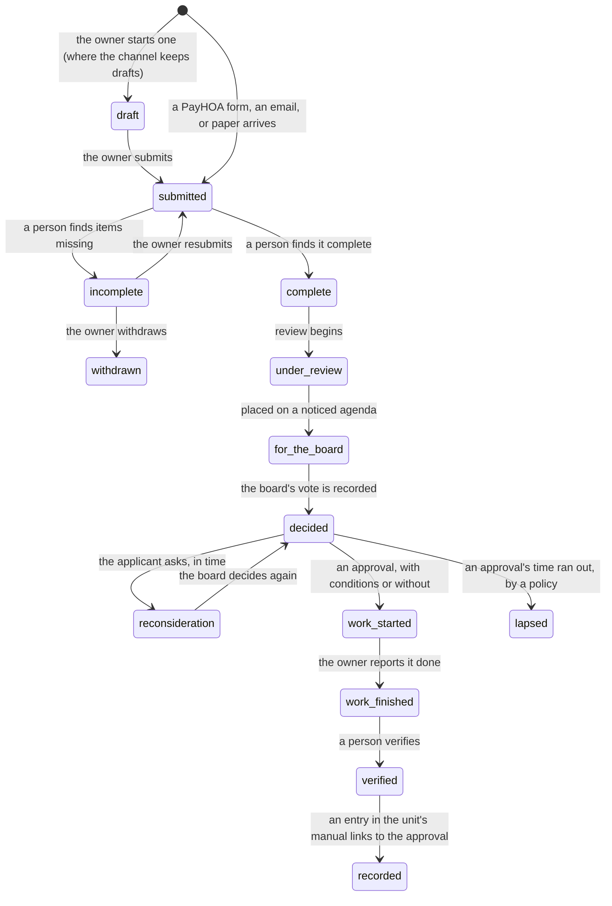

# Home improvement requests: from the owner's application to the unit's record

Status: proposal. Nothing here is built except the pieces named under "What exists". The screens are in [console/handoff-improvement-requests.md](console/handoff-improvement-requests.md). The association's own provisions, forms, and gaps are in its profile docs, not here.

An owner who wants to change a unit asks the association first. The association decides, in writing, on a clock. The change is then made, and the unit's record should say so: what was changed, who allowed it, and on what terms. Today the request, the decision, and the unit's record are three separate things. This page joins them and keeps jason inside its limits: it computes clocks, lists what is missing, drafts words, and keeps the record. It never approves, denies, or assigns a request, and it never decides what a policy should say. The board decides, by vote at a meeting, and a person records it.

## What exists

| Piece | Where | What it does now |
|---|---|---|
| A request's kind and clock | `jason.community.responses` (`ResponseKind.ARCHITECTURAL`, `SOLAR`, `EV_CHARGER`; `ResponseRule`; `ClockSource`) | Reads a PayHOA request or an emailed one as an architectural application, solar application, or charger application, and says when the answer is due and whose it is. A clock for the ordinary application exists only as a proposed policy a profile supplies |
| The notice catalog's rows | `jason.community.notice_catalog` (`architectural-decision`, `architectural-requirements`, `solar-decision`, `ev-charger-decision`, `disaster-rebuild-completeness`) | The requirement, the elements, and the clock for each written notice |
| Board items, decisions, the room | `jason board`, `jason.tasks.decisions`, the meeting room's motions and roll call | A matter, its agenda place, the motion, each director's vote by name, and the outcome, recorded by an officer |
| Letters through their stages | `jason.tasks.approvals` (draft, saved, requested, approved, sent) | A drafted letter approved by the officer or the board's recorded vote, then sent by a person |
| A unit's record | `jason.community.unit_record`, `jason.tasks.unit_records_view` and `unit_records_write` | The effective components, an owner's `ImprovementEntry` with an `approval` field, its visibility, and the loss packet ([unit-records-design.md](unit-records-design.md), [unit-records-backend.md](unit-records-backend.md)) |
| Rules and their notice | `jason rule-change`, `statutory_terms` | A proposed operating rule carried through Civil Code 4360 |
| Resale documents | `jason.community.responses` (`ResponseKind.RESALE`), the notice catalog's `resale-documents` row | The 4525 documents and the 4528 form, on their clock |

What is missing: a record that follows one request from receipt to the unit's manual; a structured application the completeness check can read; the board stage's motion and decision letter as base templates; the reconciliation of approvals against the manual; and the owner's view and outputs.

## The idea in one paragraph

A request is a record with a state. Each state names who may move it, which clock runs in it, and what is written when it moves. The states between "submitted" and "decided" are the association's work and belong to named people. "Decided" is the board's vote, recorded by an officer; jason only reads it. After the decision the record keeps going: conditions are met, work starts and ends, and a person verifies it. The record then links to the owner's entry in the unit manual, so the manual shows the approval and the approval shows what became of it. Two outputs rest on the manual: a summary of documented improvements an owner can give a buyer, and a schedule an owner can give their own insurer. A third use is the association's: at a loss, the record helps answer whether a finish was original or an upgrade. None of it states that a change is safe, lawful, insured, or worth what it cost.

## What the law says

Recited from jason's copy of the statutes (`jason cite`, the 2025 publication of the code), shortest operative words. The words govern; every reading below is labeled.

| Provision | Operative words | What it sets for this workflow |
|---|---|---|
| CIV 4765(a) | "This section applies if the governing documents require association approval before a member may make a physical change to the member's separate interest or to the common area." | Whether 4765 applies at all turns on the documents. A change the documents do not require approval for is outside it |
| CIV 4765(a)(1) | "The procedure shall be included in the association's governing documents." "The procedure shall state the maximum time for response to an application or a request for reconsideration by the board." | The review time and the reconsideration time are the documents' to state |
| CIV 4765(a)(2) | "may not be unreasonable, arbitrary, or capricious." | The standard a decision is made under |
| CIV 4765(a)(3) | "may not violate any governing provision of law" | A decision may not rest on a rule the law overrides |
| CIV 4765(a)(4) | "A decision on a proposed change shall be in writing." "the written decision shall include both an explanation of why the proposed change is disapproved and a description of the procedure for reconsideration of the decision by the board." | The decision letter's required elements |
| CIV 4765(a)(5) | "the applicant is entitled to reconsideration by the board, at an open meeting of the board." | Reconsideration. The paragraph also says it "does not require reconsideration of a decision that is made by the board or a body that has the same membership as the board, at a meeting that satisfies the requirements of Article 2" |
| CIV 4765(c) | "An association shall annually provide its members with notice of any requirements for association approval of physical changes to property." | The notice that the types of change needing approval and the procedure are given each year |
| CIV 4760(a)(1) | "Make any improvement or alteration within the boundaries of the member's separate interest that does not impair the structural integrity or mechanical systems or lessen the support of any portions of the common interest development." | A member's right, "Subject to the governing documents and applicable law" |
| CIV 4760(a)(2)(D) | "The association shall not deny approval of the proposed modifications under this paragraph without good cause." | The accessibility track: plans and specifications are submitted for review, and denial needs good cause |
| CIV 714(e)(2)(B) | "If an application is not denied in writing within 45 days from the date of receipt of the application, the application shall be deemed approved, unless that delay is the result of a reasonable request for additional information." | The solar track |
| CIV 4745(e) | "If an application is not denied in writing within 60 days from the date of receipt of the application, the application shall be deemed approved, unless that delay is the result of a reasonable request for additional information." | The charger track. Subdivision (f) lists conditions the owner agrees to, among them to "Engage a licensed contractor to install the charging station." and "Within 14 days of approval, provide a certificate of insurance" |
| CIV 4766(b)(1), (b)(3) | "no later than 30 calendar days after the body receives the application." "the application or resubmitted application shall be deemed to be complete" | The rebuild track's completeness clock. Applies to "a substantially similar reconstruction of a residential structure that was destroyed or damaged in a disaster" (4752) |
| CIV 4766(c) | "within 45 calendar days" | The rebuild track's review clock, once the application is complete |
| CIV 4766(e)(2), (f)(1) | "no later than 60 calendar days after receipt of the applicant's written appeal." "the body shall not subject the applicant to any appeals or additional hearings." | The rebuild track's appeal clock, and the end of review once approved |
| CIV 4355(a)(2), (a)(6) | "any aesthetic or architectural standards that govern alteration of a separate interest." "Any procedures for reviewing and approving or disapproving a proposed physical change to a member's separate interest or to the common area." | Rules on these subjects are the ones 4360 and 4365 reach |
| CIV 4355(b)(2) | "A decision on a specific matter that is not intended to apply generally." | A decision on one request is not a rule change |
| CIV 4350 | "(a) The rule is in writing." "(e) The rule is reasonable." | What makes an operating rule valid and enforceable |
| CIV 4360(a) | "at least 28 days before making the rule change." | The notice a rule on these subjects needs before the board adopts it |
| CIV 4150 | "Governing documents" means the declaration and "other documents, such as bylaws, operating rules, articles of incorporation, or articles of association" | An operating rule can be the procedure 4765(a)(1) asks for |
| CIV 4910(a), 4930(a) | "The board shall not take action on any item of business outside of a board meeting." "unless the item was placed on the agenda included in the notice" | The board decides at a noticed meeting, on an agenda item |
| CIV 4935(a) | "to consider litigation, matters relating to the formation of contracts with third parties, member discipline, personnel matters, or to meet with a member, upon the member's request, regarding the member's payment of assessments" | The executive-session subjects. An application is not named. A possible violation is a discipline matter |

**Readings, labeled.**

- *jason's reading (a):* 4765 sets no period for an ordinary application. It requires the documents' procedure to state one. Where the documents state none, the statute is unmet by the documents, not silent. The gap is a board matter: a rule on subject 4355(a)(6), adopted with 28 days' notice.
- *jason's reading (b):* 4765(a)(4) asks the written disapproval to describe "the procedure for reconsideration," and (a)(5) says reconsideration is not required of a decision the board itself made at a qualifying open meeting. Read to give each its effect, the letter describes the procedure the association has, which may be a written request for the board to reconsider at its next open meeting. Whether a decision made at a qualifying meeting needs any such procedure is a second reading. Two readings remain; the board asks counsel.
- *jason's reading (c):* The documents' own standard ("in its sole discretion," where a document says so) and 4765(a)(2) can both be obeyed: the board alone decides, and decides in good faith, not arbitrarily. That is not a `Conflict` row ("Follow what is written, as far as a higher authority allows"). Counsel may read it differently.

## The workflow as states

A request has one state at a time. The names are the words on screen. `RequestState` is the enum to add; JSON stores the word and the loader turns it into the symbol.



| State | Meaning | Who moves it | A clock that runs | What is written when it moves |
|---|---|---|---|---|
| draft | The owner is preparing it. Only where the channel keeps drafts | the owner | none | nothing the association holds |
| submitted | The association has it. This is the day its clocks count from (the day received, in the association's time zone) | the channel, or a person entering an emailed or paper request | acknowledgment (a policy), then completeness | the request, its channel and address (a PayHOA request id, a thread, a paper form), its received day |
| incomplete | A person found items missing. The list names each item and how to supply it | a person, the manager by default | the rebuild track's 30 days to say so; for the rest, a policy's. A pause may start (below) | a `Determination`: the missing items, who, when |
| complete | A person found it complete, or a statute deems it so | a person; or the statute (4766(b)(3)) | the review clock, by the track | a `Determination` |
| under review | A reviewer reads it: the standards, the plans, the unit's components, earlier decisions | a person (the manager, or a committee the board appointed, where the documents allow) | the review clock | a `Review` |
| for the board | On a noticed agenda | the secretary or manager puts it on; the board sets the agenda | the notice (4920) and the decision date | a board item, an agenda place |
| decided | Approved, approved with conditions, or denied. The board's vote at a meeting, recorded by an officer | the board; an officer records it | the letter's delivery; the reconsideration request window | a `Decision` (the existing record), its conditions, its letter |
| reconsideration | The applicant asked the board to reconsider a denial | the applicant asks; the board decides at an open meeting | the documents' reconsideration time; 4766(e)(2) for a rebuild | a second `Decision`, linked to the first |
| work started, work finished | The owner's word, with the day | the owner, or a person entering what the owner reported | the approval's lifetime (a policy) | a `Completion` |
| verified | A person confirmed the work and its conditions against what was approved | a person, named | none | the verification, its evidence, who and when |
| recorded | The owner's `ImprovementEntry` links to the approval | the owner, or a person for the owner, in the owner's name | none | the link in both directions |
| withdrawn | The owner withdrew it | the owner | stops | the day |
| lapsed | An approval's start or finish time ran out under a written policy | a person recording it | none | the day and the policy |

**Rules the states keep.**

- jason moves no request to approved or denied. "Decided" exists only when a decision record exists: the motion, the roll call by name, the meeting's date, the officer who recorded it (CIV 4910, 4930). A request's PayHOA status is a person's to set. jason never sets a status that says approved or denied.
- Completeness is a person's word. jason lists what the profile's checklist says is present and absent (a lead); a named person signs the determination.
- A state that waits on someone says who: "Waiting on the owner for a scale plan, from Oct 3," "On the board's agenda for Oct 20," "Waiting on the secretary to record the vote."
- A state is never reached by silence. "None on record is not none given."

### Tracks

A request takes a track. The track decides the clocks and the words of the decision. The kind comes from the existing classifier; the track adds rows for what it does not yet name.

| Track | Provision | Completeness | Decision | If the clock runs out | Appeal or reconsideration |
|---|---|---|---|---|---|
| Ordinary | 4765, the documents, the board's rules | the documents' procedure, else a proposed policy | the documents' maximum time, else a proposed policy | not stated by the statute; the documents may say | 4765(a)(5); the documents' time |
| Accessibility modification | 4760(a)(2) | as ordinary | as ordinary; the association "shall not deny approval ... without good cause" | as ordinary | as ordinary |
| Solar | 714 | a reasonable request for more information keeps the deemed approval from running | 45 days from receipt | "deemed approved," unless the delay came from a reasonable request for information | not stated by that section; as ordinary |
| Charger | 4745 | the same | 60 days from receipt | the same | not stated by that section; as ordinary |
| Variance (where the documents provide one) | the documents | the documents' procedure | the documents' times | the documents say | the documents say |
| Disaster rebuild | 4752, 4766 | 30 calendar days; "deemed to be complete" if missed | 45 calendar days from complete | no deemed approval is stated in 4766 | an appeal through 4765, decided within 60 calendar days |

A request that cites one of these provisions in its words is classified by the existing kind rows and shown with its track's clock. A track whose application cannot be read from the words ("a request for an accessible ramp") is a lead for a person, who sets the track. A miss stays a miss: an unclassified request gets the general clock and a question.

## The clocks

Each clock has a source word, shown everywhere it appears: **set by the statute**, **set by the governing documents**, **proposed policy, not adopted**, or **no clock on record**. A proposed clock is a target until the board adopts it. The words come from `ClockSource`.

| Clock | Source | Where it lives | Status |
|---|---|---|---|
| Solar decision, 45 days | the statute (714(e)(2)(B)) | `ResponseRule` `STATUTE`, the catalog's `solar-decision`; add a `Term` row ("solar decision": `CIV` `714`, 45) | rule built; `Term` proposed |
| Charger decision, 60 days | the statute (4745(e)) | `ResponseRule` `STATUTE`, the catalog's `ev-charger-decision`; add a `Term` ("charger decision": `CIV` `4745`, 60) | rule built; `Term` proposed |
| Rebuild completeness, 30 calendar days | the statute (4766(b)(1)) | the catalog's `disaster-rebuild-completeness`; add `Term`s for 30, 45, and 60 (completeness, review, appeal) | row built; `Term`s proposed; a `ResponseKind` and rule for the rebuild track proposed |
| Notice of a rule on these subjects, 28 days | the statute (4360(a)) | `statutory_terms` "notice of a rule change" | built |
| Board meeting notice, four days | the statute (4920(a)) | `statutory_terms` "board meeting notice" | built |
| Ordinary application: acknowledgment, completeness, decision, reconsideration | the governing documents, else a proposed policy | `ResponseRule` with `ClockSource.DOCUMENTS` or `POLICY`; the profile's `response_rules()` | one proposed row today (decision time); the rest proposed below |
| Approval's lifetime: start by, finish by | a proposed policy | a profile rule | proposed |
| A condition's due day | the decision's own words | the `Condition` record | proposed |

A `Term` row names the section, the value, words the section's text must carry with the value, and every constant that holds it. `tests/test_statutory_terms.py` then fails the build if the statute changes. The five proposed rows above are the statutory clocks jason checks that have no `Term` yet.

**Anchors.** The notice catalog counts from `Anchor.APPLICATION_RECEIVED`. The workflow adds three: the day an application is complete (determined, or deemed), the day reconsideration was requested, and the day an appeal was received.

**A pause.** A clock can stop while the association waits on the owner (`PauseReason`: `waiting_on_member`). Only a policy clock pauses, for the reasons its row lists. A statute's clock pauses only where its words say so, and the row recites them: the solar and charger clocks carry "unless that delay is the result of a reasonable request for additional information." A pause is a person's record ("Waiting on the owner for the scale plan, from Oct 3"), never jason's guess. The days paused are added to the due day, and both days are kept.

**Which meeting meets the clock.** The board meets on a schedule. A clock that runs out between meetings is missed unless the board plans for it. For each open request jason computes, from the meeting schedule (`MeetingSchedule`) and the notice period (`Community.board_notice_period()`), the last scheduled meeting on or before the due day and the day its notice must go out. That is a computed clock, labeled so. Where no scheduled meeting falls in time, the request says "No scheduled meeting falls before the due day: a special meeting, or the policy's pause." The choice is the board's.

## Where the documents are silent: policies proposed for the board

"Where the law is silent, write it down." The statute requires the procedure to be in the governing documents and to state its times. A document that is silent leaves a gap the board fills with a written rule, applied the same way every time and recorded each time it is used. jason proposes; the board adopts. A rule on subject 4355(a)(2) or (a)(6) needs notice to members before adoption (`jason rule-change`); a decision on one request does not (4355(b)(2)).

Each row below is a proposal with the question it answers. A profile's docs say which rows its documents already answer. The proposal's door is the standards proposal ([response-standards-design.md](response-standards-design.md#adopting-it), proposed, not built), which drafts each row as a board item with the decision brief's options: adopt as proposed, adopt with changes, keep it internal only.

| Policy key | The gap | What the policy would set | Needs 4360 notice |
|---|---|---|---|
| `improvement-review-time` | 4765(a)(1) asks for maximum times; the documents may state none | Acknowledgment (a short number of business days), the completeness determination, the decision (days from complete), the reconsideration decision (days from the request). The statute's own tracks use 30, 45, and 60; a board that picks slower times for the ordinary track writes down why. The pause reasons and a ceiling on total paused days | yes |
| `improvement-approval-needed` | 4765 reaches only changes the documents require approval for; owners ask what needs it | A written list of change categories and where each falls: approval required, not required, or undetermined. The annual notice (4765(c)) carries the list | yes |
| `improvement-application-contents` | The documents may not say what an application contains | A checklist by change category: drawings to scale (and how many copies), specifications and materials, location, the contractor's name and licence and insurance, the permit when one is needed, neighbor acknowledgment where the change affects a neighbor. The checklist is the only basis for "incomplete" | yes |
| `improvement-delegation` | The documents may name the board as the decider and say nothing of a manager or a committee | The manager may find an application complete or incomplete and ask for items. A committee, where the documents allow one, reviews and reports; it does not decide. Only the board approves or denies. A category pre-approved by a written rule, with its conditions, is an option the brief lists; whether the documents allow the board to delegate that way is for counsel | yes, for any pre-approved category |
| `improvement-conditions` | The documents may carry general conditions on the form but not a rule | A standard list the board can attach by name (comply with the documents; obtain governmental approvals; keep materials off parking areas and streets; certificate of insurance; licensed contractor), plus a free line. A condition has a due day and what proves it | the standard list: yes |
| `improvement-lifetime` | Nothing says how long an approval lasts | Start within a number of months; finish within a number of months; one extension on request. After that the approval lapses, and a new application is made | yes |
| `improvement-verification` | Nothing says what shows that work matches the approval | What a person accepts (a permit's final, photographs, a visit), who may verify, and that the association is not required to inspect a separate interest (4525(a)(5) says its resale paragraph does not "require an association to inspect an owner's separate interest") | no, internal |
| `improvement-reconsideration` | 4765(a)(4) asks the letter to describe a procedure | How to ask (in writing, within a number of days of the letter), the board's next open meeting, the written answer within the documents' time | yes |
| `improvement-neighbors` | A form may ask for neighbor acknowledgment; nothing says what it does | Who counts as affected, that an acknowledgment is awareness and not consent, that a neighbor's comment is advisory, and that a neighbor's name and signature stay in the request's file | yes, if it shapes the procedure |
| `improvement-records` | Whether a request and its decision are association records, and for how long they are kept, is open | Retention (for as long as the change exists, or a number of years), a copy of the owner's own file to the owner on request, and who may inspect another member's request (counsel reads 5200 and 5215) | no |
| `improvement-unapproved-work` | A finding that work was done with no approval on file needs a path | Who reviews a lead, that the first step is a question to the owner and not a notice, that a possible violation goes through the enforcement policy and 5855, and whether an entry an owner shared may start a lead (below) | no, internal; the enforcement steps are the enforcement policy's |
| `improvement-statements` | An owner or a buyer may ask the association for a statement of approved improvements | Whether the association gives a copy of an owner's own approval letters on request, the fee, and that it is separate from the 4525 documents (below) | no |

## The request at intake

**Channels.** An application arrives by a PayHOA form, an email, or paper. The first is read from the stored requests (`jason sync-catalog`); the others are entered by a person (`jason request-links --create THREAD --yes` enters an emailed request in PayHOA). jason enters a request and never approves, denies, or assigns it.

**A structured application.** The checklist for completeness needs structured answers. A profile defines the application once as a `FormTemplate` row ([forms.md](forms.md)): the change's category, its location, the components it touches, what it replaces, the contractor, the permit, the neighbors, the owner's words on whether it is like for like or different. The renderers make the paper form, the fillable PDF, and the PayHOA form from the one definition. A live PayHOA form is never deleted or replaced once a link points to it: it gains questions through `jason forms --payhoa KEY --update`, which keeps each question's id and its answers.

**Does it need approval?** A request is first asked whether the documents require approval for this kind of change. The profile states its answer as `ChangeRule` rows over the change's location and the component's kind, read by the same three-valued evaluator the applicability design uses ([applicability.md](applicability.md)): approval required, not required, or **undetermined**. A change the rows do not reach is undetermined, shown with the missing fact, never "not required." An undetermined answer becomes a question for the board or counsel and, once answered, a new row. This is where 4765's opening words are applied: if the documents do not require approval, 4765 does not apply, and the request is answered as a question.

**The checklist.** The profile's `Community.improvement_checklist(category)` lists the items an application of that category carries. jason marks each present, missing, or "for a person" (a fact only a person can read from an attachment). The list is jason's reading of the form; the determination is a person's.

**The incomplete notice.** A base template, written once, lists the missing items and how to supply each. The statute's own words for the rebuild track set its shape: "a list of incomplete items and a description of how the application can be made complete." The same shape serves the ordinary track. A resubmission is judged against the items that were listed, and the checklist in force on the day the application came in.

## Review

A `Review` is a person's record: who reviewed, in what role, when, which standards they read (addresses, recited at render), the earlier decisions on similar changes, and a note. A reviewer's recommendation is the reviewer's, labeled with their name. It is not jason's, and it does not enter the board's decision brief as jason's. Where the documents let the board appoint a standing committee, the committee reads and reports; it does not act for the association.

What jason assembles for the reviewer, all from stored records:

- the application and its attachments, with the checklist;
- the recited standards: the provisions the documents and rules give for this change, recited whole with their citations, then the board's adopted standards (rule rows), each with its adoption;
- the unit's components the change touches: the original specification for the unit's plan, the effective record, any entries the owner has shared, and the builder-option status where it applies;
- **earlier decisions** on similar requests, listed with their outcomes (`response_sources` precedents, `decisions.json`). Consistency is the board's evidence of good faith and its defence against a claim of selective treatment. jason lists; a person reads. "A precedent shows past handling, not this matter's facts."

## The board stage

**The agenda item.** A board item is made for the request (`tasks.board_items`): the title names the unit and the kind of change in general words, the ask is "decide", the authority is the provisions, the evidence is the request's address and the review. It goes in open session. An application is not a subject 4935(a) names; a possible violation is a member-discipline matter and follows the board-item rules for sessions, held in the private view like any executive item. The item must be on the agenda in the notice given under 4920 (4930(a)); an item continued from a meeting not more than 30 calendar days before may be acted on at the next (4930(d)(3)).

**What the open packet carries.** The members' copy of the packet and the agenda name the unit and the kind of change in general words. The owner's phone number, the contractor, the neighbors' names and signatures, and any cost stay in the directors' packet. Minutes of a board meeting other than an executive session are available to members (4950(a)), and the decision appears in them.

**The decision brief.** The existing `DecisionBrief` lays out the question, the criteria, lettered options, and the facts. Here the question is "Approve, approve with conditions, or deny the request of the owner of 123 Main St for [the change]." The criteria are the recited standards (each with its citation) and, from 4765, the three the decision must meet: good faith and not arbitrary (a)(2), not contrary to law (a)(3), in writing with the stated elements (a)(4). The options are lettered: approve; approve with these conditions (chosen from the standard list and the reviewer's); deny, stating each reason against a recited standard; continue to a named meeting; refer to a named person or committee; table. The facts are the application, the checklist result, the review's findings and precedents. The store refuses a brief body that names a recommendation. A reviewer's recommendation, if there is one, is shown beside the brief as the reviewer's, with their name.

**The motion's words.** A base template, `improvement-motion`, renders the motion from the request: the unit, the date received, the change in the applicant's words, the plans received, the standard recited, and the form of the decision. For example: "Move to approve the request of the owner of [UNIT ADDRESS], received [DATE], to [CHANGE AS DESCRIBED], as shown in the plans received [DATE], subject to the conditions stated in [LIST]." The profile supplies the citation of its own procedure through the existing `architectural-review` citation purpose. A person edits the text and records it; the secretary records mover and second.

**The vote.** The roll call is by name, recorded by an officer, with the meeting's date (`decisions.json`; the room's `RollCall`). A director who is the applicant or who disclosed an interest is recorded as recused, by the secretary on the director's disclosure; jason infers none. A vote that the recusal rule leaves undecided is held ("not on file; ask counsel"). A motion to table, continue, or refer is its own decision. The outcome's word is the board's.

**The decision letter.** A base template, `architectural-decision`, written once, rendered for the profile with its name, letterhead, and procedure citation. It is a letter with the stages `jason.tasks.approvals` already keeps (draft, saved, requested, approved, sent), approved for its words by the officer who records the board's vote with the meeting's date. Its required elements come from the notice catalog's `architectural-decision` row, checked by `notice_elements`:

| Element | Source | In every letter |
|---|---|---|
| The decision, in writing | 4765(a)(4) | yes |
| The request it answers: the unit, the day received, the change as described | the request | yes |
| The meeting and the vote that decided it | the decision record | yes |
| Conditions, each with its due day and what shows it is met | the decision | when approved with conditions |
| If disapproved: why, each reason tied to a standard, recited | 4765(a)(4) | when denied |
| If disapproved: the procedure for reconsideration, and how and by when to ask | 4765(a)(4), (5); the profile's rule | when denied |
| For a rebuild: a full set of comments and a list of noncompliant items with how to remedy each | 4766(c)(1), (d) | in that track |
| What an approval is, and is not | the base template | yes |

The last row is a statement in the base template's own words: an approval states that the change was allowed under the association's procedure. It does not state that the change is safe, built to code, insured, or worth what it cost, and it does not decide who insures or repairs it. The words are the board's to adopt with the template.

**Delivery.** A person sends the letter and records where and when (`sentRef`). The routes are PayHOA (a comment on the request, with the letter attached, which PayHOA emails to the owner), a Gmail draft a person sends, or a Mailroom letter a person confirms (`jason mailroom --send --yes`). Posting to PayHOA's request thread has no gate today (`request-comment`); the console shows the text to copy until it has one.

**Reconsideration.** A written request in time moves the request to "reconsideration," puts it on the next open meeting's agenda, and records a second decision linked to the first (`<date>--<item>--reconsider`). A rebuild appeal has the 60-day clock.

## After the decision

**Conditions.** Each condition from the decision is a `Condition` with a due day and the evidence that shows it is met. A person marks it met, naming themselves and the evidence. A condition whose day passed with none met is a finding for the manager, in words: "Condition 2 (certificate of insurance), due Oct 20: none on record."

**Work.** The owner reports a start and a finish day through the channel (a PayHOA request, an email, the owner-facing surface when it exists). A person enters what the owner reported, naming themselves and "as reported by the owner."

**Verification.** A person confirms that what was done matches what was approved and that the conditions are met, and records the evidence (a permit's final, photographs, a visit) and the day. jason never inspects, and the association is not required to inspect a separate interest. A change that differs from what was approved is shown as a difference to read, not a violation: "The approval says [A]; the entry says [B]." Permits are the owner's records with the local agency. jason's permit reader covers the association's own collection through an adapter and holds no owner's permit, so a permit number is owner-supplied evidence.

## How the result lives in the unit's record

The request is the association's record. The entry is the owner's. They link, and neither copies the other.

```python
class RequestState(Enum): DRAFT; SUBMITTED; INCOMPLETE; COMPLETE; UNDER_REVIEW; FOR_THE_BOARD; DECIDED; RECONSIDERATION
                          WORK_STARTED; WORK_FINISHED; VERIFIED; RECORDED; WITHDRAWN; LAPSED
# The outcome is the board's word, the existing models.meetings.Outcome (approved, denied, tabled, continued, referred).
# "Approved with conditions" is approved with a non-empty conditions list; it is not a new word of the board's.
# "Does it need approval" is applicability.Answer (applies, does not apply, undetermined), shown as "approval required",
# "approval not required", "undetermined".

@dataclass(frozen=True)
class Condition: text: str; due: str = ""; proof: str = ""; met_on: str = ""; met_by: str = ""; evidence: tuple[str, ...] = ()
@dataclass(frozen=True)
class Determination: complete: bool; missing: tuple[str, ...] = (); by: str = ""; at: str = ""; deemed: bool = False
@dataclass(frozen=True)
class Review: by: str; role: str; at: str; note: str = ""; standards: tuple[str, ...] = (); precedents: tuple[str, ...] = ()
@dataclass(frozen=True)
class Completion: started: str = ""; finished: str = ""; reported_by: str = ""; verified_by: str = ""; verified_on: str = ""; evidence: tuple[str, ...] = ()
@dataclass(frozen=True)
class ImprovementRequest:
    id: str; unit: str; channel: str; source: str            # a PayHOA request id, a thread, "paper"; source is its address
    received: str; track: str; location: str; description: str
    components: tuple[str, ...] = ()                         # OriginalSpec.component names the change touches or replaces
    owners_word: ComponentStatus | None = None               # the owner's own description (like for like, better, new); not a finding
    state: RequestState = RequestState.SUBMITTED
    need: Answer = Answer.UNDETERMINED; need_why: str = ""   # the ChangeRule that decided it, or the missing fact
    determination: Determination | None = None
    reviews: tuple[Review, ...] = ()
    board_item: str = ""; decision: str = ""                 # a board item id; a decisions.json id
    outcome: str = ""; conditions: tuple[Condition, ...] = (); letter: str = ""   # the decision's word, copied from it
    completion: Completion | None = None; entries: tuple[str, ...] = ()
```

| Record | Status | Holds | Written by | Where | Level | Links |
|---|---|---|---|---|---|---|
| `ImprovementRequest` | new | The above | a person at intake, then each step's person | `<data>/<profile>/improvements/<id>.json`, under the store lock | P2 | `board_item`, `decision`, `letter`, the unit, and a PayHOA request id |
| `Decision` | existing (`board/decisions.json`) | motion, mover, second, votes, recused, outcome | an officer | the board's store | P1 for open session | `ImprovementRequest.decision` |
| `ImprovementEntry` | existing | what, where, replaces, date, contractor, permit, cost (the owner's figure), product, photos, status (the owner's word), visibility | the owner, or a person in the owner's name | `<data>/<profile>/units/<unit>/entries.json` | P2 | `approval` = `improvement:<id>` (the address); new `request` field with the id |
| `OriginalSpec` | existing | the plan's component and its source | the profile | the profile | P0 | `ImprovementRequest.components` |
| `ComponentStatus` | existing | original, equivalent replacement, upgrade, builder option, personal property, unknown | the entry's author | on the entry | P2 | the entry |
| `Finding` | new | kind, unit, evidence addresses, state | computed; a person closes | `improvements/findings.json` | P2 | the request or entry |
| `ImprovementSchedule` | new, derived | the entries chosen, the purpose, who generated it and when; never the contents | the owner, or a person at the owner's request | `exports/` and a log | P2 | the entries |

**Storage.** `improvements/` and `exports/` under the profile's data folder get rows in `access.PATH_RULES` at P2, so an unplaced file fails closed. Each write holds the store lock (`jason.locks`) and names the person who made it.

**New `Community` methods**, each with an empty default, implemented by the profile: `change_rules()` (the `ChangeRule` rows), `improvement_checklist(category)`, `improvement_conditions()` (the standard list), `improvement_policies()` (the adopted rows, each with its adoption). A profile that returns the defaults gets screens that say so.

**The evidence address.** `improvement:<id>` resolves through `jason.approvals.evidence` like any address (a rule row). A `DocRef` to the decision letter, the plans, and the attachments carries the file's own level; the request record is P2.

**How the entry and the status come out.**

- The association states no `ComponentStatus`. An approval says a change was allowed; the entry's status is the owner's word. The owner's own description on the application ("like for like," "better than what was there," "something new") is shown beside the entry as the owner's, so the owner starts from it. It is never the association's finding.
- An entry made from a request the owner submitted to the association is shared by that act (proposed). The application says so. A private entry exists only where the owner holds the manual (a folder the owner controls, or the owner-facing surface).
- The entry's `replaces` names the `OriginalSpec` component. If that component's status is a builder option, the change stays attached to the open question on whether builder options count as original; the approval does not answer it.
- `effective()` merges entries only. An approval with no entry does not change a component's status. It appears in the unit's record as an approved change not yet recorded, and in the loss packet as an approval on file for that component, which is evidence that a change was made, not that it was completed.

## Reconciliation

The record should hold together. Four kinds of gap are computed, each a lead, none an accusation. The words are fixed so they never say more than the record shows.

| Finding | When | Shown to | The words |
|---|---|---|---|
| Approval, no entry | A request is approved and finished (or past its lifetime) and no entry shared with the association links to it | the owner (a prompt: add what was done); the manager as a count | "Approved [date]. No entry shared with the association." Never "the owner did not record it" |
| Entry, no approval | An entry's change is one the profile's rows say needs approval (or leaves undetermined) and no request links to it | the owner only | "Recorded [date]. No approval on file for a change of this kind: [the row's provision]. If one was given, link it." |
| Records show work, no approval | An association record (an inspection, a complaint, a permit notice, a contractor's certificate, an owner's own words in a request) shows work the rows say needs approval, and no approval is on file | the board, as a board item | "The records show [what, where, source]. No approval is on file for it. jason does not know whether one was needed or given: a person reads the record." |
| Entry differs from the approval | An entry linked to an approval names a change or a component the approval does not | the owner; the manager | "The approval says [A]. The entry says [B]." Both shown, side by side |
| Condition open, not verified, lapsed | A condition's day passed with none met; finished with no verification; an approval's time ran out | the manager | a count and the line |

**What the association can see.** A private entry is counted and never read. For the association, reconciliation reads entries shared with it and entries it made itself. A finding computed from shared entries says "no entry shared." It cannot say there is no entry.

**Who sees an entry-without-approval finding.** The owner. The unit-records design settles it: an entry without an approval where one was required is shown as a gap to the owner, not to the board ([unit-records-design.md](unit-records-design.md)). An owner who shares the manual for a sale or an insurer should not find the sharing starts an enforcement matter without being told. The share step says so in plain words (the handoff has them). Whether an entry an owner shared may start a lead for the board is an open decision for the board and counsel; the default proposed is no.

**How a "work without approval" lead reaches the board.** It goes through the existing board-item path as a matter to look at, never a determination. Its first step is a question to the owner, a person's message. If the board then sends a notice of hearing, that is the enforcement policy's process (5855) and a record of its own. A reconciliation finding is not a notice the association sent the owner, and it is not part of the resale documents; a notice the association actually sent is (4525(a)(5)).

**Measures the board can use.** Requests by state and clock standing; the share decided within its clock; approvals with conditions open; approvals not yet recorded; the leads open. Counts only: no unit's contents are counted against it.

## Resale

Three different things are easy to run together.

| What | Whose | What it holds | Where it is governed |
|---|---|---|---|
| The association's resale documents | the association gives, the seller delivers | The documents 4525(a) lists | CIV 4525, 4528, 4530 |
| A summary of the owner's documented improvements | the owner's | The entries the owner chooses, with the approval references and copies | the owner's choice |
| A copy of an approval letter the association gave the owner | the association's record, the owner's copy | The decision letter | the profile's `improvement-statements` policy |

**What the association must provide.** The statute lists the documents. Recited: "The owner of a separate interest shall provide the following documents to a prospective purchaser" (4525(a)), among them a copy of the governing documents (a)(1), the documents distributed under Article 7 (a)(3), a statement of assessments (a)(4), "A copy or a summary of any notice previously sent to the owner pursuant to Section 5855 that sets forth any alleged violation of the governing documents that remains unresolved" (a)(5), and "A copy of the report issued pursuant to the most recent inspection conducted pursuant to Section 5551" (a)(11). An owner's improvements, and the association's approvals of them, are not on the list. Of the association's side, 4530(b)(5) says: "Any documents not expressly required by Section 4525 to be provided to a prospective purchaser by the seller shall not be included in the document disclosure required by this section. Bundling of documents required to be provided pursuant to this section with other documents relating to the transaction is prohibited." And (a)(3): "Delivery of the documents required by this section shall not be withheld for any reason nor subject to any condition except the payment of the fee."

**jason's reading.** The association adds nothing about improvements to the 4525 package, adds no condition to its delivery, and does not hold the package for an unresolved improvement matter. Anything about improvements the association gives is separate, at the owner's request, and does not travel in the package. Whether the association may attach copies of an owner's approvals to the package at the owner's request is a second question for counsel. The seller's own disclosures to a buyer under other law are the seller's and their agent's; jason does not state them.

**Where a statute puts a duty on the owner.** A charger's owner is made responsible for "Disclosing to prospective buyers the existence of any charging station of the owner and the related responsibilities of the owner under this section" (4745(f)(2)(D)). The owner's summary lists such an item so the owner is reminded. It is the owner's duty, not the association's.

**The owner's documented-improvements summary.** An output the owner chooses to share:

- one line per entry the owner includes: the date, what and where, the component it replaces, the product and model, the permit number, the approval reference, and the decision letter's copy;
- fields the owner may include or leave out: the contractor, the cost (the owner's figure), photographs;
- a header: "Prepared by the owner of this unit from the owner's own records and the association's decision letters. The association certifies nothing about it: not that the work was done, was built to code, is insured, or is worth what it cost." A footer with the date it was made and the entries' count;
- a list of the changes the owner's entries do not show an approval for, where the profile's rows said one was needed, shown to the owner before they export, never in the file unless the owner includes them.

The summary is a file the owner holds. The association does not deliver it, store it for the buyer, or add it to disclosures.

## Insurance

**The owner's side: an improvements schedule.** An owner's own policy (an HO-6 or equivalent) may count what the owner has improved. The inventory a person's insurer asks for is the manual itself. The schedule is a printable view of it for that purpose:

- rows from the owner's entries: the date, what and where, what it replaced, the product and model, the contractor, the permit and approval references, the owner's figure for the cost, photographs listed;
- a total of the owner's figures, labeled "the owner's figures, added up; not an appraisal, not a replacement cost";
- the unit's original specification beside each row where one is on file, so the difference is visible without a claim;
- a header and footer that say what it is not.

jason gives no coverage advice. It does not say what limit to carry, what an owner's policy covers, or whether any item is insured. The statute has the association tell members to do their own work: the insurance summary carries, in the statute's words, "Association members should consult with their individual insurance broker or agent for appropriate additional coverage," and says the association's policies "may not cover your property, including personal property or real property improvements to or around your dwelling" (5300(b)(9)). The schedule repeats those words, recited with the citation, and no more. Where the governing documents draw the line between what the association insures and what the owner insures, the profile recites it beside the schedule.

An optional field on an entry, "what the replaced item would have cost to replace in kind, the owner's estimate," is for a declaration that draws its line by a cost difference. Whether to ask for it at all is an open decision, because it is a valuation the carrier or an appraiser decides.

**The association's side: original or upgraded at a loss.** The loss packet's first question is what the item is. The record answers it from three layers:

1. The plan's original specification (`OriginalSpec`), with its source.
2. The owner's entries shared with the association, or opened for that unit's packet with the owner's knowledge.
3. The association's approvals for that unit, which show that a change was allowed on a day, whether or not the owner recorded it.

For each component the packet shows the status words (original, equivalent replacement, upgrade, builder option, personal property, unknown) in the two columns the packet already has, and beside them the evidence chips: the approval and its day, the entry and its day, the permit, the invoice. A component with an approval and no entry says "An approval is on file for this component, [date]. No entry is shared." That is a lead to ask the owner, drafted for a person to send. A plan with no specification stays unknown, never original. The packet's loss ladder steps are unchanged. jason never marks anything covered or not covered, and the packet says which steps a person has not confirmed.

## Privacy and visibility

| What | Owner | Manager | Directors | Counsel | Buyer or insurer | Level |
|---|---|---|---|---|---|---|
| Request, review, determination, decision, letter | own unit's | all | those on the item | granted matters | only what the owner gives them | P2 |
| The decision, in the minutes | the unit and the kind of change in general words, as any member | same | same | same | members, by 4950(a) | P1, open session |
| Contractor, cost, phone, plans | own | directors' packet | the directors' packet | granted | the owner's choice | P2 |
| Neighbors' acknowledgments (names, signatures) | the applicant sees that they were given | the file | the directors' packet | granted | never | P2, third parties' |
| An entry: private | yes | counted, never read | counted | none | the owner's choice | P2 |
| An entry: shared with the association | yes | read | when the item or packet needs it | granted | the owner's choice | P2 |
| A finding: entry without approval | yes | never | never | none | never | P2 |
| A finding: records show work | no, until a person asks | yes | as a board item | granted | never | P2, P3 if discipline |
| The owner's summary and schedule | the owner makes and holds them | not stored | no | no | what the owner hands over | P2 |

A cross-unit list never shows a contractor, a cost, or an owner's phone. The URL carries a unit id and a request id, never a name or an address. A write names the person who made it. The owner view is a view on the loopback console, not a permission and not a portal ([console/security-and-privacy.md](console/security-and-privacy.md)).

Whether a request and its decision are "association records" a member may inspect is not answered by the statute's list in 5200(a), which does not name them. Whether an inspecting member sees the applicant's identity and plans is a reading for counsel. Until then, another member's request is not shown.

## Phases

1. **Read what exists.** The request list with the track and clock, from `jason respond`; the `ChangeRule` rows and the checklist as profile methods; the completeness list as a lead.
2. **The record.** `ImprovementRequest`, `Determination`, `Review`, `Condition`, `Completion`, the store, the address, and the `request` link on an entry. The three states a person moves (determine, review, place on the agenda) behind `Confirm`.
3. **The board stage.** The brief, the motion template, the decision letter template and its elements check, the letter's stages, the delivery record.
4. **After the decision.** Conditions, work, verification, and the link to the entry.
5. **Reconciliation.** The findings, the board-item path, the counts.
6. **The owner's outputs.** The resale summary and the improvements schedule, as files an owner (or a person at the owner's request) generates.
7. **Policies adopted.** Each proposed row goes through the board, one at a time, in the order the board's meetings allow.
8. **An owner-facing surface**, after owner sign-in, with the same loaders at the owner's level.

## Open decisions

For the board or counsel:

1. Which changes the documents require approval for, and how an interior change is classed. A request that touches neither the exterior nor the common area may sit outside 4765 entirely.
2. The maximum times 4765(a)(1) asks the procedure to state, and the route (a rule on 4355(a)(6), with 28 days' notice).
3. Whether a decision made by the board at a qualifying open meeting needs a reconsideration procedure at all, given 4765(a)(4) and (a)(5).
4. Whether the board may adopt categories pre-approved by a written rule, and whether the documents allow the manager to determine completeness.
5. Whether a request, its plans, and its decision are association records a member may inspect, and what an inspecting member sees.
6. Whether an entry an owner shared may start a lead for the board.
7. Whether the association may give an owner a copy of their own approvals at the owner's request, at what fee, and whether it may attach them to the 4525 package at the owner's request (4530(b)(5)).
8. Whether to ask an owner for the replaced item's cost to replace in kind.
9. How a committee's recommendation is shown beside a brief that never recommends.
10. Whether the owner's neighbor acknowledgment stays part of an application, and what it means.
11. Who holds the unit manual while there is no owner-facing surface: an owner-held folder, or the association's copy of what the owner submitted.

## Related

- [unit-records-design.md](unit-records-design.md), [unit-records-backend.md](unit-records-backend.md): the manual, the effective record, the loss packet.
- [responses.md](responses.md), [response-standards-design.md](response-standards-design.md): kinds, clocks, pauses, and how a standard is adopted.
- [policy-catalog-design.md](policy-catalog-design.md): the `architectural-review` policy and the others a board writes down.
- [base-templates.md](base-templates.md): the base templates a profile renders.
- [notices.md](notices.md): the notice catalog and its required elements.
- [applicability.md](applicability.md): the three-valued answer used for "does it need approval."
- [console/approval-workflow.md](console/approval-workflow.md): letters, plans, and why the board decides by vote.
- [console/handoff-improvement-requests.md](console/handoff-improvement-requests.md): the screens.
